# Add Generator Product to Named Opps

## Flow Diagram [(_View History_)](Add_Generator_Product_to_Named_Opps-history.md)

```mermaid
%% If you read this, your Markdown visualizer does not handle MermaidJS syntax.
%% - If you are in VsCode, install extension `Markdown Preview Mermaid Support` at https://marketplace.visualstudio.com/items?itemName=bierner.markdown-mermaid
%% - If you are using sfdx-hardis, try to define env variable `MERMAID_MODES=cli,docker` ,then run again the command to regenerate markdown with SVG images.
%% - If you are within mkdocs-material, define mermaid plugin in `mkdocs.yml` as described in https://squidfunk.github.io/mkdocs-material/extensions/mermaid/
%% - At last resort, you can copy-paste this MermaidJS code in https://mermaid.live/ to see the Flow Diagram

flowchart TB
START(["START<br/><b>AutoLaunched Flow</b></br>Type: <b> Record After Save</b>"]):::startClass
click START "#general-information" "2623166676"

Check_Opp_Name{"🔀 <em></em><br/>Check Opp Name"}:::decisions
click Check_Opp_Name "#check_opp_name" "351654024"

Get_Pricebook[("🔍 <em></em><br/>Get Pricebook")]:::recordLookups
click Get_Pricebook "#get_pricebook" "1109185302"

Create_1000_Opp_Product[["🔗 <em>Subflow</em><br/>Create 1000 Opp Product"]]:::subflows
click Create_1000_Opp_Product "#create_1000_opp_product" "3803559005"

Create_1500_Opp_Product[["🔗 <em>Subflow</em><br/>Create 1500 Opp Product"]]:::subflows
click Create_1500_Opp_Product "#create_1500_opp_product" "677754681"

Create_2000_Opp_Product[["🔗 <em>Subflow</em><br/>Create 2000 Opp Product"]]:::subflows
click Create_2000_Opp_Product "#create_2000_opp_product" "2958090128"

Check_Opp_Name --> |"1500kW"| Create_1500_Opp_Product
Check_Opp_Name --> |"2000kW"| Create_2000_Opp_Product
Check_Opp_Name --> |"1000kW"| Create_1000_Opp_Product
Check_Opp_Name --> |"None"| END_Check_Opp_Name
Get_Pricebook --> Check_Opp_Name
START -->  Get_Pricebook
Create_1000_Opp_Product --> END_Create_1000_Opp_Product
Create_1500_Opp_Product --> END_Create_1500_Opp_Product
Create_2000_Opp_Product --> END_Create_2000_Opp_Product
END_Check_Opp_Name(( END )):::endClass
END_Create_1000_Opp_Product(( END )):::endClass
END_Create_1500_Opp_Product(( END )):::endClass
END_Create_2000_Opp_Product(( END )):::endClass


classDef actionCalls fill:#D4E4FC,color:black,text-decoration:none,max-height:100px
classDef assignments fill:#FBEED7,color:black,text-decoration:none,max-height:100px
classDef collectionProcessors fill:#F0E3FA,color:black,text-decoration:none,max-height:100px
classDef customErrors fill:#FFE9E9,color:black,text-decoration:none,max-height:100px
classDef decisions fill:#FDEAF6,color:black,text-decoration:none,max-height:100px
classDef loops fill:#FDEAF6,color:black,text-decoration:none,max-height:100px
classDef recordCreates fill:#FFF8C9,color:black,text-decoration:none,max-height:100px
classDef recordDeletes fill:#FFF8C9,color:black,text-decoration:none,max-height:100px
classDef recordLookups fill:#EDEAFF,color:black,text-decoration:none,max-height:100px
classDef recordUpdates fill:#FFF8C9,color:black,text-decoration:none,max-height:100px
classDef screens fill:#DFF6FF,color:black,text-decoration:none,max-height:100px
classDef subflows fill:#D4E4FC,color:black,text-decoration:none,max-height:100px
classDef startClass fill:#D9F2E6,color:black,text-decoration:none,max-height:100px
classDef endClass fill:#F9BABA,color:black,text-decoration:none,max-height:100px


```

<!-- Flow description -->

## General Information

|<!-- -->|<!-- -->|
|:---|:---|
|Object|Opportunity|
|Process Type| Auto Launched Flow|
|Trigger Type| Record After Save|
|Record Trigger Type| Create|
|Label|Add Generator Product to Named Opps|
|Status|Active|
|Environments|Default|
|Interview Label|Add Generator Product to Named Opps {!$Flow.CurrentDateTime}|
| Builder Type (PM)|LightningFlowBuilder|
| Canvas Mode (PM)|AUTO_LAYOUT_CANVAS|
| Origin Builder Type (PM)|LightningFlowBuilder|
|Connector|[Get_Pricebook](#get_pricebook)|
|Next Node|[Get_Pricebook](#get_pricebook)|

## Flow Nodes Details

### Check_Opp_Name

|<!-- -->|<!-- -->|
|:---|:---|
|Type|Decision|
|Label|Check Opp Name|
|Default Connector Label|None|

#### Rule X1500kW (1500kW)

|<!-- -->|<!-- -->|
|:---|:---|
|Connector|[Create_1500_Opp_Product](#create_1500_opp_product)|
|Condition Logic|and|

|Condition Id|Left Value Reference|Operator|Right Value|
|:-- |:-- |:--:|:--: |
|1|$Record.Name| Contains|1500|

#### Rule X2000kW (2000kW)

|<!-- -->|<!-- -->|
|:---|:---|
|Connector|[Create_2000_Opp_Product](#create_2000_opp_product)|
|Condition Logic|and|

|Condition Id|Left Value Reference|Operator|Right Value|
|:-- |:-- |:--:|:--: |
|1|$Record.Name| Contains|2000|

#### Rule X1000kW (1000kW)

|<!-- -->|<!-- -->|
|:---|:---|
|Connector|[Create_1000_Opp_Product](#create_1000_opp_product)|
|Condition Logic|and|

|Condition Id|Left Value Reference|Operator|Right Value|
|:-- |:-- |:--:|:--: |
|1|$Record.Name| Contains|1000|

### Get_Pricebook

|<!-- -->|<!-- -->|
|:---|:---|
|Type|Record Lookup|
|Object|Pricebook2|
|Label|Get Pricebook|
|Assign Null Values If No Records Found|⬜|
|Get First Record Only|✅|
|Store Output Automatically|✅|
|Connector|[Check_Opp_Name](#check_opp_name)|

#### Filters (logic: **and**)

|Filter Id|Field|Operator|Value|
|:-- |:-- |:--:|:--: |
|1|Name| Equal To|Standard Price Book|

### Create_1000_Opp_Product

|<!-- -->|<!-- -->|
|:---|:---|
|Type|Subflow|
|Label|Create 1000 Opp Product|
|Flow Name|Subflow_Create_Generator_Opp_Product|

#### Input Assignments

|Field|Value|
|:-- |:--: |
|<!-- -->|$Record.Id|
|<!-- -->|Get_Pricebook.Id|
|<!-- -->|1000|

### Create_1500_Opp_Product

|<!-- -->|<!-- -->|
|:---|:---|
|Type|Subflow|
|Label|Create 1500 Opp Product|
|Flow Name|Subflow_Create_Generator_Opp_Product|

#### Input Assignments

|Field|Value|
|:-- |:--: |
|<!-- -->|$Record.Id|
|<!-- -->|Get_Pricebook.Id|
|<!-- -->|1500|

### Create_2000_Opp_Product

|<!-- -->|<!-- -->|
|:---|:---|
|Type|Subflow|
|Label|Create 2000 Opp Product|
|Flow Name|Subflow_Create_Generator_Opp_Product|

#### Input Assignments

|Field|Value|
|:-- |:--: |
|<!-- -->|$Record.Id|
|<!-- -->|Get_Pricebook.Id|
|<!-- -->|2000|

___

_Documentation generated from branch master by [sfdx-hardis](https://sfdx-hardis.cloudity.com), featuring [salesforce-flow-visualiser](https://github.com/toddhalfpenny/salesforce-flow-visualiser)_