# Add VIP to Description

## Flow Diagram [(_View History_)](Add_VIP_to_Description-history.md)

```mermaid
%% If you read this, your Markdown visualizer does not handle MermaidJS syntax.
%% - If you are in VsCode, install extension `Markdown Preview Mermaid Support` at https://marketplace.visualstudio.com/items?itemName=bierner.markdown-mermaid
%% - If you are using sfdx-hardis, try to define env variable `MERMAID_MODES=cli,docker` ,then run again the command to regenerate markdown with SVG images.
%% - If you are within mkdocs-material, define mermaid plugin in `mkdocs.yml` as described in https://squidfunk.github.io/mkdocs-material/extensions/mermaid/
%% - At last resort, you can copy-paste this MermaidJS code in https://mermaid.live/ to see the Flow Diagram

flowchart TB
START(["START<br/><b>AutoLaunched Flow</b></br>Type: <b> Record After Save</b>"]):::startClass
click START "#general-information" "800336444"

Append_Description_to_VIP_Description[\"🟰 <em></em><br/>Append Description to VIP_Description"/]:::assignments
click Append_Description_to_VIP_Description "#append_description_to_vip_description" "404541275"

Get_Account[("🔍 <em></em><br/>Get Account")]:::recordLookups
click Get_Account "#get_account" "2668496547"

Update_Account_Description[("🛠️ <em></em><br/>Update Account Description")]:::recordUpdates
click Update_Account_Description "#update_account_description" "1158063827"

Append_Description_to_VIP_Description --> Update_Account_Description
Get_Account --> Append_Description_to_VIP_Description
Update_Account_Description --> END_Update_Account_Description
START -->  Get_Account
END_Update_Account_Description(( END )):::endClass


classDef actionCalls fill:#D4E4FC,color:black,text-decoration:none,max-height:100px
classDef assignments fill:#FBEED7,color:black,text-decoration:none,max-height:100px
classDef collectionProcessors fill:#F0E3FA,color:black,text-decoration:none,max-height:100px
classDef customErrors fill:#FFE9E9,color:black,text-decoration:none,max-height:100px
classDef decisions fill:#FDEAF6,color:black,text-decoration:none,max-height:100px
classDef loops fill:#FDEAF6,color:black,text-decoration:none,max-height:100px
classDef recordCreates fill:#FFF8C9,color:black,text-decoration:none,max-height:100px
classDef recordDeletes fill:#FFF8C9,color:black,text-decoration:none,max-height:100px
classDef recordLookups fill:#EDEAFF,color:black,text-decoration:none,max-height:100px
classDef recordUpdates fill:#FFF8C9,color:black,text-decoration:none,max-height:100px
classDef screens fill:#DFF6FF,color:black,text-decoration:none,max-height:100px
classDef subflows fill:#D4E4FC,color:black,text-decoration:none,max-height:100px
classDef startClass fill:#D9F2E6,color:black,text-decoration:none,max-height:100px
classDef endClass fill:#F9BABA,color:black,text-decoration:none,max-height:100px


```

<!-- Flow description -->

## General Information

|<!-- -->|<!-- -->|
|:---|:---|
|Object|Opportunity|
|Process Type| Auto Launched Flow|
|Trigger Type| Record After Save|
|Record Trigger Type| Update|
|Label|Add VIP to Description|
|Status|Active|
|Does Require Record Changed To Meet Criteria|✅|
|Environments|Default|
|Interview Label|Add VIP to Description {!$Flow.CurrentDateTime}|
| Builder Type (PM)|LightningFlowBuilder|
| Canvas Mode (PM)|AUTO_LAYOUT_CANVAS|
| Origin Builder Type (PM)|LightningFlowBuilder|
|Connector|[Get_Account](#get_account)|
|Next Node|[Get_Account](#get_account)|

#### Filters (logic: **and**)

|Filter Id|Field|Operator|Value|
|:-- |:-- |:--:|:--: |
|1|StageName| Equal To|Closed Won|
|2|Name| Contains|VIP|

## Variables

|Name|Data Type|Is Collection|Is Input|Is Output|Object Type|Description|
|:-- |:--:|:--:|:--:|:--:|:--:|:--  |
|VIP_Description|String|⬜|⬜|⬜|<!-- -->|<!-- -->|

## Flow Nodes Details

### Append_Description_to_VIP_Description

|<!-- -->|<!-- -->|
|:---|:---|
|Type|Assignment|
|Label|Append Description to VIP_Description|
|Connector|[Update_Account_Description](#update_account_description)|

#### Assignments

|Assign To Reference|Operator|Value|
|:-- |:--:|:--: |
|VIP_Description| Add|Get_Account.Description|

### Get_Account

|<!-- -->|<!-- -->|
|:---|:---|
|Type|Record Lookup|
|Object|Account|
|Label|Get Account|
|Assign Null Values If No Records Found|⬜|
|Get First Record Only|✅|
|Store Output Automatically|✅|
|Connector|[Append_Description_to_VIP_Description](#append_description_to_vip_description)|

#### Filters (logic: **and**)

|Filter Id|Field|Operator|Value|
|:-- |:-- |:--:|:--: |
|1|Id| Equal To|$Record.AccountId|

### Update_Account_Description

|<!-- -->|<!-- -->|
|:---|:---|
|Type|Record Update|
|Label|Update Account Description|
|Input Reference|$Record.Account|

#### Input Assignments

|Field|Value|
|:-- |:--: |
|Description|VIP_Description|

___

_Documentation generated from branch master by [sfdx-hardis](https://sfdx-hardis.cloudity.com), featuring [salesforce-flow-visualiser](https://github.com/toddhalfpenny/salesforce-flow-visualiser)_