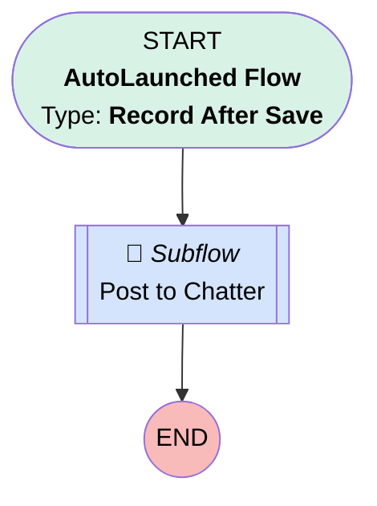

# Case Priority is High

## Flow Diagram [(_View History_)](Case_Priority_is_High-history.md)

<!-- Flow description -->

## General Information

|<!-- -->|<!-- -->|
|:---|:---|
|Object|Case|
|Process Type| Auto Launched Flow|
|Trigger Type| Record After Save|
|Record Trigger Type| Create And Update|
|Label|Case Priority is High|
|Status|⚠️ Draft|
|Does Require Record Changed To Meet Criteria|✅|
|Environments|Default|
|Interview Label|Case Priority is High {!$Flow.CurrentDateTime}|
| Builder Type (PM)|LightningFlowBuilder|
| Canvas Mode (PM)|AUTO_LAYOUT_CANVAS|
| Origin Builder Type (PM)|LightningFlowBuilder|
|Connector|[Post_to_Chatter](#post_to_chatter)|
|Next Node|[Post_to_Chatter](#post_to_chatter)|

#### Filters (logic: **and**)

|Filter Id|Field|Operator|Value|
|:-- |:-- |:--:|:--: |
|1|Priority| Equal To|High|

## Flow Nodes Details

### Post_to_Chatter

|<!-- -->|<!-- -->|
|:---|:---|
|Type|Subflow|
|Label|Post to Chatter|
|Flow Name|[Post_to_Chatter](#post_to_chatter)|
|Store Output Automatically|✅|

#### Input Assignments

|Field|Value|
|:-- |:--: |
|<!-- -->|$Record.Id|
|<!-- -->|$Record.OwnerId|

___

_Documentation generated from branch master by [sfdx-hardis](https://sfdx-hardis.cloudity.com), featuring [salesforce-flow-visualiser](https://github.com/toddhalfpenny/salesforce-flow-visualiser)_