# Check New Lead for Matching Account

## Flow Diagram [(_View History_)](Check_New_Lead_for_Matching_Account-history.md)

```mermaid
%% If you read this, your Markdown visualizer does not handle MermaidJS syntax.
%% - If you are in VsCode, install extension `Markdown Preview Mermaid Support` at https://marketplace.visualstudio.com/items?itemName=bierner.markdown-mermaid
%% - If you are using sfdx-hardis, try to define env variable `MERMAID_MODES=cli,docker` ,then run again the command to regenerate markdown with SVG images.
%% - If you are within mkdocs-material, define mermaid plugin in `mkdocs.yml` as described in https://squidfunk.github.io/mkdocs-material/extensions/mermaid/
%% - At last resort, you can copy-paste this MermaidJS code in https://mermaid.live/ to see the Flow Diagram

flowchart TB
START(["START<br/><b>AutoLaunched Flow</b></br>Type: <b> Record After Save</b>"]):::startClass
click START "#general-information" "1312313450"

Chatter_Post_to_Account_Owner("⚡ <em></em><br/>Chatter Post to Account Owner"):::actionCalls
click Chatter_Post_to_Account_Owner "#chatter_post_to_account_owner" "4051155618"

Email_Lead_Routing("📧 <em></em><br/>Email Lead Routing"):::actionCalls
click Email_Lead_Routing "#email_lead_routing" "1859108476"

Look_for_Matching_Account[("🔍 <em></em><br/>Look for Matching Account")]:::recordLookups
click Look_for_Matching_Account "#look_for_matching_account" "2427832237"

Update_Matching_Account[("🛠️ <em></em><br/>Update Matching Account")]:::recordUpdates
click Update_Matching_Account "#update_matching_account" "2267680379"

Chatter_Post_to_Account_Owner --> Email_Lead_Routing
Email_Lead_Routing --> END_Email_Lead_Routing
Look_for_Matching_Account --> Update_Matching_Account
Update_Matching_Account --> Chatter_Post_to_Account_Owner
START -->  Look_for_Matching_Account
END_Email_Lead_Routing(( END )):::endClass


classDef actionCalls fill:#D4E4FC,color:black,text-decoration:none,max-height:100px
classDef assignments fill:#FBEED7,color:black,text-decoration:none,max-height:100px
classDef collectionProcessors fill:#F0E3FA,color:black,text-decoration:none,max-height:100px
classDef customErrors fill:#FFE9E9,color:black,text-decoration:none,max-height:100px
classDef decisions fill:#FDEAF6,color:black,text-decoration:none,max-height:100px
classDef loops fill:#FDEAF6,color:black,text-decoration:none,max-height:100px
classDef recordCreates fill:#FFF8C9,color:black,text-decoration:none,max-height:100px
classDef recordDeletes fill:#FFF8C9,color:black,text-decoration:none,max-height:100px
classDef recordLookups fill:#EDEAFF,color:black,text-decoration:none,max-height:100px
classDef recordUpdates fill:#FFF8C9,color:black,text-decoration:none,max-height:100px
classDef screens fill:#DFF6FF,color:black,text-decoration:none,max-height:100px
classDef subflows fill:#D4E4FC,color:black,text-decoration:none,max-height:100px
classDef startClass fill:#D9F2E6,color:black,text-decoration:none,max-height:100px
classDef endClass fill:#F9BABA,color:black,text-decoration:none,max-height:100px


```

<!-- Flow description -->

## General Information

|<!-- -->|<!-- -->|
|:---|:---|
|Object|Lead|
|Process Type| Auto Launched Flow|
|Trigger Type| Record After Save|
|Record Trigger Type| Create|
|Label|Check New Lead for Matching Account|
|Status|⚠️ Draft|
|Environments|Default|
|Interview Label|Check New Lead for Matching Account {!$Flow.CurrentDateTime}|
| Builder Type (PM)|LightningFlowBuilder|
| Canvas Mode (PM)|AUTO_LAYOUT_CANVAS|
| Origin Builder Type (PM)|LightningFlowBuilder|
|Connector|[Look_for_Matching_Account](#look_for_matching_account)|
|Next Node|[Look_for_Matching_Account](#look_for_matching_account)|

## Flow Nodes Details

### Chatter_Post_to_Account_Owner

|<!-- -->|<!-- -->|
|:---|:---|
|Type|Action Call|
|Label|Chatter Post to Account Owner|
|Action Type|Chatter Post|
|Action Name|chatterPost|
|Flow Transaction Model|CurrentTransaction|
|Name Segment|chatterPost|
|Store Output Automatically|✅|
|Text (input)|ChatterMessage|
|Subject Name Or Id (input)|$Record.Id|
|Connector|[Email_Lead_Routing](#email_lead_routing)|

### Email_Lead_Routing

|<!-- -->|<!-- -->|
|:---|:---|
|Type|Action Call|
|Label|Email Lead Routing|
|Action Type|Email Alert|
|Action Name|Lead.Send_Matching_Account_to_Lead_Routing|
|Flow Transaction Model|CurrentTransaction|
|Name Segment|Lead.Send_Matching_Account_to_Lead_Routing|
| SObject Row Id (input)|$Record.Id|

### Look_for_Matching_Account

|<!-- -->|<!-- -->|
|:---|:---|
|Type|Record Lookup|
|Object|Account|
|Label|Look for Matching Account|
|Assign Null Values If No Records Found|⬜|
|Get First Record Only|✅|
|Sort Field|CreatedDate|
|Sort Order|Desc|
|Store Output Automatically|✅|
|Connector|[Update_Matching_Account](#update_matching_account)|

#### Filters (logic: **and**)

|Filter Id|Field|Operator|Value|
|:-- |:-- |:--:|:--: |
|1|Name| Equal To|$Record.Company|

### Update_Matching_Account

|<!-- -->|<!-- -->|
|:---|:---|
|Type|Record Update|
|Label|Update Matching Account|
|Input Reference|$Record|
|Connector|[Chatter_Post_to_Account_Owner](#chatter_post_to_account_owner)|

#### Input Assignments

|Field|Value|
|:-- |:--: |
|Possible_Matching_Account__c|Look_for_Matching_Account.Id|

___

_Documentation generated from branch master by [sfdx-hardis](https://sfdx-hardis.cloudity.com), featuring [salesforce-flow-visualiser](https://github.com/toddhalfpenny/salesforce-flow-visualiser)_