# Convert to Customer

## Flow Diagram [(_View History_)](Convert_to_Customer-history.md)

```mermaid
%% If you read this, your Markdown visualizer does not handle MermaidJS syntax.
%% - If you are in VsCode, install extension `Markdown Preview Mermaid Support` at https://marketplace.visualstudio.com/items?itemName=bierner.markdown-mermaid
%% - If you are using sfdx-hardis, try to define env variable `MERMAID_MODES=cli,docker` ,then run again the command to regenerate markdown with SVG images.
%% - If you are within mkdocs-material, define mermaid plugin in `mkdocs.yml` as described in https://squidfunk.github.io/mkdocs-material/extensions/mermaid/
%% - At last resort, you can copy-paste this MermaidJS code in https://mermaid.live/ to see the Flow Diagram

flowchart TB
START(["START<br/><b>AutoLaunched Flow</b></br>"]):::startClass
click START "#general-information" "339627388"

Create_Onboarding_Task[("➕ <em></em><br/>Create Onboarding Task")]:::recordCreates
click Create_Onboarding_Task "#create_onboarding_task" "1969935422"

Set_Type_to_Customer[("🛠️ <em></em><br/>Set Type to Customer")]:::recordUpdates
click Set_Type_to_Customer "#set_type_to_customer" "2047455376"

Create_Onboarding_Task --> END_Create_Onboarding_Task
Set_Type_to_Customer --> Create_Onboarding_Task
START -->  Set_Type_to_Customer
END_Create_Onboarding_Task(( END )):::endClass


classDef actionCalls fill:#D4E4FC,color:black,text-decoration:none,max-height:100px
classDef assignments fill:#FBEED7,color:black,text-decoration:none,max-height:100px
classDef collectionProcessors fill:#F0E3FA,color:black,text-decoration:none,max-height:100px
classDef customErrors fill:#FFE9E9,color:black,text-decoration:none,max-height:100px
classDef decisions fill:#FDEAF6,color:black,text-decoration:none,max-height:100px
classDef loops fill:#FDEAF6,color:black,text-decoration:none,max-height:100px
classDef recordCreates fill:#FFF8C9,color:black,text-decoration:none,max-height:100px
classDef recordDeletes fill:#FFF8C9,color:black,text-decoration:none,max-height:100px
classDef recordLookups fill:#EDEAFF,color:black,text-decoration:none,max-height:100px
classDef recordUpdates fill:#FFF8C9,color:black,text-decoration:none,max-height:100px
classDef screens fill:#DFF6FF,color:black,text-decoration:none,max-height:100px
classDef subflows fill:#D4E4FC,color:black,text-decoration:none,max-height:100px
classDef startClass fill:#D9F2E6,color:black,text-decoration:none,max-height:100px
classDef endClass fill:#F9BABA,color:black,text-decoration:none,max-height:100px


```

<!-- Flow description -->

## General Information

|<!-- -->|<!-- -->|
|:---|:---|
|Process Type| Auto Launched Flow|
|Label|Convert to Customer|
|Status|⚠️ Draft|
|Environments|Default|
|Interview Label|Convert to Customer {!$Flow.CurrentDateTime}|
| Builder Type (PM)|LightningFlowBuilder|
| Canvas Mode (PM)|AUTO_LAYOUT_CANVAS|
| Origin Builder Type (PM)|LightningFlowBuilder|
|Connector|[Set_Type_to_Customer](#set_type_to_customer)|
|Next Node|[Set_Type_to_Customer](#set_type_to_customer)|

## Variables

|Name|Data Type|Is Collection|Is Input|Is Output|Object Type|Description|
|:-- |:--:|:--:|:--:|:--:|:--:|:--  |
|accountID|String|⬜|✅|⬜|<!-- -->|<!-- -->|

## Formulas

|Name|Data Type|Expression|Description|
|:-- |:--:|:-- |:--  |
|WeekFromToday|Date|TODAY() + 7|<!-- -->|

## Flow Nodes Details

### Create_Onboarding_Task

|<!-- -->|<!-- -->|
|:---|:---|
|Type|Record Create|
|Object|Task|
|Label|Create Onboarding Task|
|Store Output Automatically|✅|

#### Input Assignments

|Field|Value|
|:-- |:--: |
|ActivityDate|WeekFromToday|
|Priority|High|
|Status|Not Started|
|Subject|Reach Out for Onboarding|
|WhatId|accountID|

### Set_Type_to_Customer

|<!-- -->|<!-- -->|
|:---|:---|
|Type|Record Update|
|Object|Account|
|Label|Set Type to Customer|
|Connector|[Create_Onboarding_Task](#create_onboarding_task)|

#### Filters (logic: **and**)

|Filter Id|Field|Operator|Value|
|:-- |:-- |:--:|:--: |
|1|Id| Equal To|accountID|

#### Input Assignments

|Field|Value|
|:-- |:--: |
|Type|Customer - Direct|

___

_Documentation generated from branch master by [sfdx-hardis](https://sfdx-hardis.cloudity.com), featuring [salesforce-flow-visualiser](https://github.com/toddhalfpenny/salesforce-flow-visualiser)_