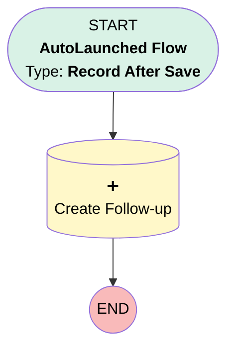

# Create Follow-Up on New Prospect

## Flow Diagram [(_View History_)](Create_Follow_Up_on_New_Prospect-history.md)

<!-- Flow description -->

## General Information

|<!-- -->|<!-- -->|
|:---|:---|
|Object|Account|
|Process Type| Auto Launched Flow|
|Trigger Type| Record After Save|
|Record Trigger Type| Create|
|Label|Create Follow-Up on New Prospect|
|Status|Active|
|Environments|Default|
|Interview Label|Create Follow-Up on New Prospect {!$Flow.CurrentDateTime}|
| Builder Type (PM)|LightningFlowBuilder|
| Canvas Mode (PM)|AUTO_LAYOUT_CANVAS|
| Origin Builder Type (PM)|LightningFlowBuilder|
|Connector|[Create_Follow_up](#create_follow_up)|
|Next Node|[Create_Follow_up](#create_follow_up)|

#### Filters (logic: **and**)

|Filter Id|Field|Operator|Value|
|:-- |:-- |:--:|:--: |
|1|Type| Equal To|Prospect|

## Flow Nodes Details

### Create_Follow_up

|<!-- -->|<!-- -->|
|:---|:---|
|Type|Record Create|
|Object|Task|
|Label|Create Follow-up|
|Description|Create a task named Follow-Up Discovery Call, assigned to the account’s owner|
|Store Output Automatically|✅|

#### Input Assignments

|Field|Value|
|:-- |:--: |
|OwnerId|$Record.OwnerId|
|Priority|Normal|
|Status|Not Started|
|Subject|Follow-Up Discovery Call|
|WhatId|$Record.Id|

___

_Documentation generated from branch master by [sfdx-hardis](https://sfdx-hardis.cloudity.com), featuring [salesforce-flow-visualiser](https://github.com/toddhalfpenny/salesforce-flow-visualiser)_