# Create Follow-Up with Decision Maker

## Flow Diagram [(_View History_)](Create_Follow_Up_with_Decision_Maker-history.md)

```mermaid
%% If you read this, your Markdown visualizer does not handle MermaidJS syntax.
%% - If you are in VsCode, install extension `Markdown Preview Mermaid Support` at https://marketplace.visualstudio.com/items?itemName=bierner.markdown-mermaid
%% - If you are using sfdx-hardis, try to define env variable `MERMAID_MODES=cli,docker` ,then run again the command to regenerate markdown with SVG images.
%% - If you are within mkdocs-material, define mermaid plugin in `mkdocs.yml` as described in https://squidfunk.github.io/mkdocs-material/extensions/mermaid/
%% - At last resort, you can copy-paste this MermaidJS code in https://mermaid.live/ to see the Flow Diagram

flowchart TB
START(["START<br/><b>AutoLaunched Flow</b></br>Type: <b> Record After Save</b>"]):::startClass
click START "#general-information" "4294934056"

Create_Task[("➕ <em></em><br/>Create Task")]:::recordCreates
click Create_Task "#create_task" "305873011"

Get_Decision_Maker[("🔍 <em></em><br/>Get Decision Maker")]:::recordLookups
click Get_Decision_Maker "#get_decision_maker" "2030660191"

Create_Task --> END_Create_Task
Get_Decision_Maker --> Create_Task
START -->  Get_Decision_Maker
END_Create_Task(( END )):::endClass


classDef actionCalls fill:#D4E4FC,color:black,text-decoration:none,max-height:100px
classDef assignments fill:#FBEED7,color:black,text-decoration:none,max-height:100px
classDef collectionProcessors fill:#F0E3FA,color:black,text-decoration:none,max-height:100px
classDef customErrors fill:#FFE9E9,color:black,text-decoration:none,max-height:100px
classDef decisions fill:#FDEAF6,color:black,text-decoration:none,max-height:100px
classDef loops fill:#FDEAF6,color:black,text-decoration:none,max-height:100px
classDef recordCreates fill:#FFF8C9,color:black,text-decoration:none,max-height:100px
classDef recordDeletes fill:#FFF8C9,color:black,text-decoration:none,max-height:100px
classDef recordLookups fill:#EDEAFF,color:black,text-decoration:none,max-height:100px
classDef recordUpdates fill:#FFF8C9,color:black,text-decoration:none,max-height:100px
classDef screens fill:#DFF6FF,color:black,text-decoration:none,max-height:100px
classDef subflows fill:#D4E4FC,color:black,text-decoration:none,max-height:100px
classDef startClass fill:#D9F2E6,color:black,text-decoration:none,max-height:100px
classDef endClass fill:#F9BABA,color:black,text-decoration:none,max-height:100px


```

<!-- Flow description -->

## General Information

|<!-- -->|<!-- -->|
|:---|:---|
|Object|Opportunity|
|Process Type| Auto Launched Flow|
|Trigger Type| Record After Save|
|Record Trigger Type| Update|
|Label|Create Follow-Up with Decision Maker|
|Status|⚠️ Draft|
|Does Require Record Changed To Meet Criteria|✅|
|Environments|Default|
|Interview Label|Create Follow-Up with Decision Maker {!$Flow.CurrentDateTime}|
| Builder Type (PM)|LightningFlowBuilder|
| Canvas Mode (PM)|AUTO_LAYOUT_CANVAS|
| Origin Builder Type (PM)|LightningFlowBuilder|
|Connector|[Get_Decision_Maker](#get_decision_maker)|
|Next Node|[Get_Decision_Maker](#get_decision_maker)|

#### Filters (logic: **and**)

|Filter Id|Field|Operator|Value|
|:-- |:-- |:--:|:--: |
|1|StageName| Equal To|Closed Lost|
|2|Amount| Greater Than Or Equal To|10000|

## Flow Nodes Details

### Create_Task

|<!-- -->|<!-- -->|
|:---|:---|
|Type|Record Create|
|Object|Task|
|Label|Create Task|
|Store Output Automatically|✅|

#### Input Assignments

|Field|Value|
|:-- |:--: |
|OwnerId|$Record.OwnerId|
|Priority|Normal|
|Status|Not Started|
|Subject|Closed Lost Follow-Up|
|WhatId|$Record.Id|
|WhoId|Get_Decision_Maker.Contact.Id|

### Get_Decision_Maker

|<!-- -->|<!-- -->|
|:---|:---|
|Type|Record Lookup|
|Object|OpportunityContactRole|
|Label|Get Decision Maker|
|Assign Null Values If No Records Found|⬜|
|Get First Record Only|✅|
|Sort Field|CreatedDate|
|Sort Order|Desc|
|Store Output Automatically|✅|
|Connector|[Create_Task](#create_task)|

#### Filters (logic: **and**)

|Filter Id|Field|Operator|Value|
|:-- |:-- |:--:|:--: |
|1|OpportunityId| Equal To|$Record.Id|
|2|Role| Equal To|Decision Maker|

___

_Documentation generated from branch master by [sfdx-hardis](https://sfdx-hardis.cloudity.com), featuring [salesforce-flow-visualiser](https://github.com/toddhalfpenny/salesforce-flow-visualiser)_