# Create Property

## Flow Diagram [(_View History_)](Create_property-history.md)

```mermaid
%% If you read this, your Markdown visualizer does not handle MermaidJS syntax.
%% - If you are in VsCode, install extension `Markdown Preview Mermaid Support` at https://marketplace.visualstudio.com/items?itemName=bierner.markdown-mermaid
%% - If you are using sfdx-hardis, try to define env variable `MERMAID_MODES=cli,docker` ,then run again the command to regenerate markdown with SVG images.
%% - If you are within mkdocs-material, define mermaid plugin in `mkdocs.yml` as described in https://squidfunk.github.io/mkdocs-material/extensions/mermaid/
%% - At last resort, you can copy-paste this MermaidJS code in https://mermaid.live/ to see the Flow Diagram

flowchart TB
START(["START<br/><b>Screen Flow</b>"]):::startClass
click START "#general-information" "1762088839"

geocode_address("⚙️ <em></em><br/>Geocode Address"):::actionCalls
click geocode_address "#geocode_address" "3081698357"

If_content_document_found{"🔀 <em></em><br/>If Content Document found"}:::decisions
click If_content_document_found "#if_content_document_found" "352819708"

if_content_version_found{"🔀 <em></em><br/>If Content Version found"}:::decisions
click if_content_version_found "#if_content_version_found" "3723549978"

create_property[("➕ <em></em><br/>Create Property")]:::recordCreates
click create_property "#create_property" "1780942107"

get_main_content_document[("🔍 <em></em><br/>Get Main Content Document")]:::recordLookups
click get_main_content_document "#get_main_content_document" "1459039029"

get_main_content_version[("🔍 <em></em><br/>Get Main Content Version")]:::recordLookups
click get_main_content_version "#get_main_content_version" "3808214063"

set_main_picture[("🛠️ <em></em><br/>Set Property Main Picture & Thumbnail")]:::recordUpdates
click set_main_picture "#set_main_picture" "2615460595"

address(["💻 <em></em><br/>Address"]):::screens
click address "#address" "4179254069"

Error2(["💻 <em></em><br/>Error"]):::screens
click Error2 "#error2" "999924728"

Error3(["💻 <em></em><br/>Error"]):::screens
click Error3 "#error3" "1549393736"

Error4(["💻 <em></em><br/>Error"]):::screens
click Error4 "#error4" "699941739"

Error5(["💻 <em></em><br/>Error"]):::screens
click Error5 "#error5" "1223530341"

error_creating_records(["💻 <em></em><br/>Error"]):::screens
click error_creating_records "#error_creating_records" "797250711"

navigate_to_record_detail(["💻 <em></em><br/>Navigate to Record"]):::screens
click navigate_to_record_detail "#navigate_to_record_detail" "2222512430"

new_property(["💻 <em></em><br/>New Property"]):::screens
click new_property "#new_property" "2660527283"

property_details(["💻 <em></em><br/>Property Details"]):::screens
click property_details "#property_details" "2449036476"

upload_picture(["💻 <em></em><br/>Upload Picture"]):::screens
click upload_picture "#upload_picture" "2651511476"

geocode_address --> property_details
geocode_address -. Fault .->Error5
If_content_document_found --> |"Content Document Found"| get_main_content_version
If_content_document_found --> |"Default Outcome"| navigate_to_record_detail
if_content_version_found --> |"Picture Found"| set_main_picture
if_content_version_found --> |"Default Outcome"| navigate_to_record_detail
create_property --> upload_picture
create_property -. Fault .->error_creating_records
get_main_content_document --> If_content_document_found
get_main_content_document -. Fault .->Error2
get_main_content_version --> if_content_version_found
get_main_content_version -. Fault .->Error3
set_main_picture --> navigate_to_record_detail
set_main_picture -. Fault .->Error4
address --> geocode_address
Error2 --> END_Error2
Error3 --> END_Error3
Error4 --> END_Error4
Error5 --> END_Error5
error_creating_records --> END_error_creating_records
navigate_to_record_detail --> END_navigate_to_record_detail
new_property --> address
property_details --> create_property
upload_picture --> get_main_content_document
START -->  new_property
END_Error2(( END )):::endClass
END_Error3(( END )):::endClass
END_Error4(( END )):::endClass
END_Error5(( END )):::endClass
END_error_creating_records(( END )):::endClass
END_navigate_to_record_detail(( END )):::endClass


classDef actionCalls fill:#D4E4FC,color:black,text-decoration:none,max-height:100px
classDef assignments fill:#FBEED7,color:black,text-decoration:none,max-height:100px
classDef collectionProcessors fill:#F0E3FA,color:black,text-decoration:none,max-height:100px
classDef customErrors fill:#FFE9E9,color:black,text-decoration:none,max-height:100px
classDef decisions fill:#FDEAF6,color:black,text-decoration:none,max-height:100px
classDef loops fill:#FDEAF6,color:black,text-decoration:none,max-height:100px
classDef recordCreates fill:#FFF8C9,color:black,text-decoration:none,max-height:100px
classDef recordDeletes fill:#FFF8C9,color:black,text-decoration:none,max-height:100px
classDef recordLookups fill:#EDEAFF,color:black,text-decoration:none,max-height:100px
classDef recordUpdates fill:#FFF8C9,color:black,text-decoration:none,max-height:100px
classDef screens fill:#DFF6FF,color:black,text-decoration:none,max-height:100px
classDef subflows fill:#D4E4FC,color:black,text-decoration:none,max-height:100px
classDef startClass fill:#D9F2E6,color:black,text-decoration:none,max-height:100px
classDef endClass fill:#F9BABA,color:black,text-decoration:none,max-height:100px


```

<!-- Flow description -->

## General Information

|<!-- -->|<!-- -->|
|:---|:---|
|Process Type| Flow|
|Label|Create Property|
|Status|Active|
|Description|This flow helps agents creating new properties in just a few clicks. It calculates the geocoded address calling out to a 3rd party service.|
|Interview Label|Create Property {!$Flow.CurrentDateTime}|
| Builder Type (PM)|LightningFlowBuilder|
| Canvas Mode (PM)|AUTO_LAYOUT_CANVAS|
| Origin Builder Type (PM)|LightningFlowBuilder|
|Connector|[new_property](#new_property)|
|Next Node|[new_property](#new_property)|

## Formulas

|Name|Data Type|Expression|Description|
|:-- |:--:|:-- |:--  |
|main_picture_url|String|"/sfc/servlet.shepherd/version/download/" + {!get_main_content_version.Id}|Main picture URL that we'll use as thumbnail|

## Flow Nodes Details

### geocode_address

|<!-- -->|<!-- -->|
|:---|:---|
|Type|Action Call|
|Label|Geocode Address|
|Action Type|Apex|
|Action Name|[GeocodingService](../apex/GeocodingService.md)|
|Fault Connector|[Error5](#error5)|
|Flow Transaction Model|CurrentTransaction|
|Name Segment|GeocodingService|
|Store Output Automatically|✅|
|City (input)|property_address.city|
|Country (input)|property_address.country|
|Postalcode (input)|property_address.postalCode|
|State (input)|property_address.province|
|Street (input)|property_address.street|
|Connector|[property_details](#property_details)|

### If_content_document_found

|<!-- -->|<!-- -->|
|:---|:---|
|Type|Decision|
|Label|If Content Document found|
|Default Connector|[navigate_to_record_detail](#navigate_to_record_detail)|
|Default Connector Label|Default Outcome|

#### Rule Content_Document_Link_found (Content Document Found)

|<!-- -->|<!-- -->|
|:---|:---|
|Connector|[get_main_content_version](#get_main_content_version)|
|Condition Logic|and|

|Condition Id|Left Value Reference|Operator|Right Value|
|:-- |:-- |:--:|:--: |
|1|[get_main_content_document](#get_main_content_document)| Is Null|⬜|

### if_content_version_found

|<!-- -->|<!-- -->|
|:---|:---|
|Type|Decision|
|Label|If Content Version found|
|Default Connector|[navigate_to_record_detail](#navigate_to_record_detail)|
|Default Connector Label|Default Outcome|

#### Rule picture_found (Picture Found)

|<!-- -->|<!-- -->|
|:---|:---|
|Connector|[set_main_picture](#set_main_picture)|
|Condition Logic|and|

|Condition Id|Left Value Reference|Operator|Right Value|
|:-- |:-- |:--:|:--: |
|1|[get_main_content_version](#get_main_content_version)| Is Null|⬜|

### create_property

|<!-- -->|<!-- -->|
|:---|:---|
|Type|Record Create|
|Object|Property__c|
|Label|Create Property|
|Fault Connector|[error_creating_records](#error_creating_records)|
|Store Output Automatically|✅|
|Connector|[upload_picture](#upload_picture)|

#### Input Assignments

|Field|Value|
|:-- |:--: |
|Address__c|property_address.street|
|Baths__c|number_of_baths|
|Beds__c|number_of_beds|
|Broker__c|property_broker.recordId|
|City__c|property_address.city|
|Date_Listed__c|$Flow.CurrentDate|
|Description__c|property_description|
|Location__Latitude__s|geocode_address.lat|
|Location__Longitude__s|geocode_address.lon|
|Name|property_name|
|Price__c|property_price|
|State__c|property_address.province|
|Status__c|Available|
|Tags__c|property_tags|
|Zip__c|property_address.postalCode|

### get_main_content_document

|<!-- -->|<!-- -->|
|:---|:---|
|Type|Record Lookup|
|Object|ContentDocumentLink|
|Label|Get Main Content Document|
|Description|Retrieve just one of the pictures to be the main one|
|Assign Null Values If No Records Found|⬜|
|Fault Connector|[Error2](#error2)|
|Get First Record Only|✅|
|Store Output Automatically|✅|
|Connector|[If_content_document_found](#if_content_document_found)|

#### Filters (logic: **and**)

|Filter Id|Field|Operator|Value|
|:-- |:-- |:--:|:--: |
|1|LinkedEntityId| Equal To|[create_property](#create_property)|

### get_main_content_version

|<!-- -->|<!-- -->|
|:---|:---|
|Type|Record Lookup|
|Object|ContentVersion|
|Label|Get Main Content Version|
|Assign Null Values If No Records Found|⬜|
|Fault Connector|[Error3](#error3)|
|Get First Record Only|✅|
|Store Output Automatically|✅|
|Connector|[if_content_version_found](#if_content_version_found)|

#### Filters (logic: **and**)

|Filter Id|Field|Operator|Value|
|:-- |:-- |:--:|:--: |
|1|ContentDocumentId| Equal To|get_main_content_document.ContentDocumentId|
|2|IsLatest| Equal To|✅|

### set_main_picture

|<!-- -->|<!-- -->|
|:---|:---|
|Type|Record Update|
|Object|Property__c|
|Label|Set Property Main Picture & Thumbnail|
|Fault Connector|[Error4](#error4)|
|Connector|[navigate_to_record_detail](#navigate_to_record_detail)|

#### Filters (logic: **and**)

|Filter Id|Field|Operator|Value|
|:-- |:-- |:--:|:--: |
|1|Id| Equal To|[create_property](#create_property)|

#### Input Assignments

|Field|Value|
|:-- |:--: |
|Picture__c|main_picture_url|
|Thumbnail__c|main_picture_url|

### address

|<!-- -->|<!-- -->|
|:---|:---|
|Type|Screen|
|Label|Address|
|Allow Back|✅|
|Allow Finish|✅|
|Allow Pause|✅|
|Show Footer|✅|
|Show Header|✅|
|Connector|[geocode_address](#geocode_address)|

#### property_address

|<!-- -->|<!-- -->|
|:---|:---|
|Extension Name|flowruntime:address|
|Field Type| Component Instance|
|Inputs On Next Nav To Assoc Scrn| Use Stored Values|
|Is Required|✅|
|Store Output Automatically|✅|

### Error2

|<!-- -->|<!-- -->|
|:---|:---|
|Type|Screen|
|Label|Error|
|Allow Back|✅|
|Allow Finish|✅|
|Allow Pause|✅|
|Show Footer|✅|
|Show Header|✅|

#### error2_text

|<!-- -->|<!-- -->|
|:---|:---|
|Field Text|
Unknown error retrieving uploaded picture.
|
|Field Type| Display Text|

### Error3

|<!-- -->|<!-- -->|
|:---|:---|
|Type|Screen|
|Label|Error|
|Allow Back|✅|
|Allow Finish|✅|
|Allow Pause|✅|
|Show Footer|✅|
|Show Header|✅|

#### error3_text

|<!-- -->|<!-- -->|
|:---|:---|
|Field Text|
Unknown error retrieving uploaded picture.
|
|Field Type| Display Text|

### Error4

|<!-- -->|<!-- -->|
|:---|:---|
|Type|Screen|
|Label|Error|
|Allow Back|⬜|
|Allow Finish|✅|
|Allow Pause|✅|
|Show Footer|✅|
|Show Header|✅|

#### error4_text

|<!-- -->|<!-- -->|
|:---|:---|
|Field Text|
Unknown error setting picture as Property thumbnail.
|
|Field Type| Display Text|

### Error5

|<!-- -->|<!-- -->|
|:---|:---|
|Type|Screen|
|Label|Error|
|Allow Back|✅|
|Allow Finish|✅|
|Allow Pause|✅|
|Show Footer|✅|
|Show Header|✅|

#### error5_text

|<!-- -->|<!-- -->|
|:---|:---|
|Field Text|
Error retrieving geocoded address.
|
|Field Type| Display Text|

### error_creating_records

|<!-- -->|<!-- -->|
|:---|:---|
|Type|Screen|
|Label|Error|
|Allow Back|⬜|
|Allow Finish|✅|
|Allow Pause|✅|
|Show Footer|✅|
|Show Header|✅|

#### error

|<!-- -->|<!-- -->|
|:---|:---|
|Field Text|
Error creating records. Try again.
|
|Field Type| Display Text|

### navigate_to_record_detail

|<!-- -->|<!-- -->|
|:---|:---|
|Type|Screen|
|Label|Navigate to Record|
|Allow Back|⬜|
|Allow Finish|✅|
|Allow Pause|✅|
|Show Footer|✅|
|Show Header|✅|

#### navigate_to_record_lwc

|<!-- -->|<!-- -->|
|:---|:---|
|Extension Name|c:navigateToRecord|
|Field Type| Component Instance|
|Inputs On Next Nav To Assoc Scrn| Use Stored Values|
|Is Required|✅|
|Store Output Automatically|✅|
|Record Id (input)|[create_property](#create_property)|

### new_property

|<!-- -->|<!-- -->|
|:---|:---|
|Type|Screen|
|Label|New Property|
|Allow Back|✅|
|Allow Finish|✅|
|Allow Pause|✅|
|Show Footer|✅|
|Show Header|✅|
|Connector|[address](#address)|

#### property_name

|<!-- -->|<!-- -->|
|:---|:---|
|Data Type|String|
|Field Text|Property Name|
|Field Type| Input Field|
|Is Required|✅|

#### property_description

|<!-- -->|<!-- -->|
|:---|:---|
|Data Type|String|
|Field Text|Description|
|Field Type| Input Field|
|Is Required|⬜|

#### property_broker

|<!-- -->|<!-- -->|
|:---|:---|
|Extension Name|flowruntime:lookup|
|Field Type| Component Instance|
|Inputs On Next Nav To Assoc Scrn| Use Stored Values|
|Is Required|✅|
|Store Output Automatically|✅|
|Field Api Name (input)|Broker__c|
|Label (input)|Broker|
|Object Api Name (input)|Property__c|

#### property_price

|<!-- -->|<!-- -->|
|:---|:---|
|Data Type|Currency|
|Default Value|100000|
|Field Text|Price|
|Field Type| Input Field|
|Is Required|✅|
|Scale|0|

### property_details

|<!-- -->|<!-- -->|
|:---|:---|
|Type|Screen|
|Label|Property Details|
|Allow Back|✅|
|Allow Finish|✅|
|Allow Pause|✅|
|Show Footer|✅|
|Show Header|✅|
|Connector|[create_property](#create_property)|

#### number_of_beds

|<!-- -->|<!-- -->|
|:---|:---|
|Data Type|Number|
|Default Value|4|
|Field Text|Number of Bedrooms|
|Field Type| Input Field|
|Is Required|⬜|
|Scale|0|

#### number_of_baths

|<!-- -->|<!-- -->|
|:---|:---|
|Data Type|Number|
|Default Value|2|
|Field Text|Number of Bathrooms|
|Field Type| Input Field|
|Is Required|⬜|
|Scale|0|

#### property_tags

|<!-- -->|<!-- -->|
|:---|:---|
|Data Type|String|
|Field Text|Tags|
|Field Type| Input Field|
|Is Required|⬜|

### upload_picture

|<!-- -->|<!-- -->|
|:---|:---|
|Type|Screen|
|Label|Upload Picture|
|Allow Back|⬜|
|Allow Finish|✅|
|Allow Pause|✅|
|Show Footer|✅|
|Show Header|✅|
|Connector|[get_main_content_document](#get_main_content_document)|

#### property_picture

|<!-- -->|<!-- -->|
|:---|:---|
|Extension Name|forceContent:fileUpload|
|Field Type| Component Instance|
|Inputs On Next Nav To Assoc Scrn| Use Stored Values|
|Is Required|✅|
|Store Output Automatically|✅|
|Label (input)|Upload Picture|
|Accept (input)|.jpg,.png,.gif|
|Record Id (input)|[create_property](#create_property)|
|Multiple (input)|✅|

___

_Documentation generated from branch master by [sfdx-hardis](https://sfdx-hardis.cloudity.com), featuring [salesforce-flow-visualiser](https://github.com/toddhalfpenny/salesforce-flow-visualiser)_