# Fetch Related Records

## Flow Diagram [(_View History_)](Fetch_Related_Records-history.md)

```mermaid
%% If you read this, your Markdown visualizer does not handle MermaidJS syntax.
%% - If you are in VsCode, install extension `Markdown Preview Mermaid Support` at https://marketplace.visualstudio.com/items?itemName=bierner.markdown-mermaid
%% - If you are using sfdx-hardis, try to define env variable `MERMAID_MODES=cli,docker` ,then run again the command to regenerate markdown with SVG images.
%% - If you are within mkdocs-material, define mermaid plugin in `mkdocs.yml` as described in https://squidfunk.github.io/mkdocs-material/extensions/mermaid/
%% - At last resort, you can copy-paste this MermaidJS code in https://mermaid.live/ to see the Flow Diagram

flowchart TB
START(["START<br/><b>Screen Flow</b>"]):::startClass
click START "#general-information" "2335761529"

Related_Contacts[("🔍 <em></em><br/>Related Contacts")]:::recordLookups
click Related_Contacts "#related_contacts" "3228751088"

Related_Opportunity[("🔍 <em></em><br/>Related Opportunity")]:::recordLookups
click Related_Opportunity "#related_opportunity" "2283995317"

Display_Related_Information(["💻 <em></em><br/>Display Related Information"]):::screens
click Display_Related_Information "#display_related_information" "1559023566"

Related_Contacts --> Related_Opportunity
Related_Opportunity --> Display_Related_Information
Display_Related_Information --> END_Display_Related_Information
START -->  Related_Contacts
END_Display_Related_Information(( END )):::endClass


classDef actionCalls fill:#D4E4FC,color:black,text-decoration:none,max-height:100px
classDef assignments fill:#FBEED7,color:black,text-decoration:none,max-height:100px
classDef collectionProcessors fill:#F0E3FA,color:black,text-decoration:none,max-height:100px
classDef customErrors fill:#FFE9E9,color:black,text-decoration:none,max-height:100px
classDef decisions fill:#FDEAF6,color:black,text-decoration:none,max-height:100px
classDef loops fill:#FDEAF6,color:black,text-decoration:none,max-height:100px
classDef recordCreates fill:#FFF8C9,color:black,text-decoration:none,max-height:100px
classDef recordDeletes fill:#FFF8C9,color:black,text-decoration:none,max-height:100px
classDef recordLookups fill:#EDEAFF,color:black,text-decoration:none,max-height:100px
classDef recordUpdates fill:#FFF8C9,color:black,text-decoration:none,max-height:100px
classDef screens fill:#DFF6FF,color:black,text-decoration:none,max-height:100px
classDef subflows fill:#D4E4FC,color:black,text-decoration:none,max-height:100px
classDef startClass fill:#D9F2E6,color:black,text-decoration:none,max-height:100px
classDef endClass fill:#F9BABA,color:black,text-decoration:none,max-height:100px


```

<!-- Flow description -->

## General Information

|<!-- -->|<!-- -->|
|:---|:---|
|Process Type| Flow|
|Label|Fetch Related Records|
|Status|⚠️ Draft|
|Environments|Default|
|Interview Label|Fetch Related Records {!$Flow.CurrentDateTime}|
| Builder Type (PM)|LightningFlowBuilder|
| Canvas Mode (PM)|AUTO_LAYOUT_CANVAS|
| Origin Builder Type (PM)|LightningFlowBuilder|
|Connector|[Related_Contacts](#related_contacts)|
|Next Node|[Related_Contacts](#related_contacts)|

## Variables

|Name|Data Type|Is Collection|Is Input|Is Output|Object Type|Description|
|:-- |:--:|:--:|:--:|:--:|:--:|:--  |
|AccountRecord|SObject|⬜|✅|⬜|Account|<!-- -->|

## Flow Nodes Details

### Related_Contacts

|<!-- -->|<!-- -->|
|:---|:---|
|Type|Record Lookup|
|Object|Contact|
|Label|Related Contacts|
|Assign Null Values If No Records Found|⬜|
|Get First Record Only|⬜|
|Store Output Automatically|✅|
|Connector|[Related_Opportunity](#related_opportunity)|

#### Filters (logic: **and**)

|Filter Id|Field|Operator|Value|
|:-- |:-- |:--:|:--: |
|1|AccountId| Equal To|AccountRecord.Id|

### Related_Opportunity

|<!-- -->|<!-- -->|
|:---|:---|
|Type|Record Lookup|
|Object|Opportunity|
|Label|Related Opportunity|
|Assign Null Values If No Records Found|⬜|
|Get First Record Only|⬜|
|Store Output Automatically|✅|
|Connector|[Display_Related_Information](#display_related_information)|

#### Filters (logic: **and**)

|Filter Id|Field|Operator|Value|
|:-- |:-- |:--:|:--: |
|1|AccountId| Equal To|AccountRecord.Id|

### Display_Related_Information

|<!-- -->|<!-- -->|
|:---|:---|
|Type|Screen|
|Label|Display Related Information|
|Allow Back|✅|
|Allow Finish|✅|
|Allow Pause|✅|
|Show Footer|✅|
|Show Header|✅|

#### Related_Contacts_Data_Table

|<!-- -->|<!-- -->|
|:---|:---|
|Data Type Mappings|typeName: T typeValue: Contact |
|Extension Name|flowruntime:datatable|
|Field Type| Component Instance|
|Inputs On Next Nav To Assoc Scrn| Use Stored Values|
|Is Required|✅|
|Store Output Automatically|✅|
|Label (input)|Data Table|
|Selection Mode (input)|NO_SELECTION|
|Min Row Selection (input)|numberValue: 0 |
|Should Display Label (input)|✅|
|Table Data (input)|[Related_Contacts](#related_contacts)|
|Max Row Selection (input)|numberValue: 0 |
|Columns (input)|[{"apiName":"Name","guid":"column-f5c3","editable":false,"hasCustomHeaderLabel":true,"customHeaderLabel":"Name","wrapText":true,"order":0,"label":"Full Name","type":"text"},{"apiName":"Email","guid":"column-2edf","editable":false,"hasCustomHeaderLabel":true,"customHeaderLabel":"Email","wrapText":true,"order":1,"label":"Email","type":"email"}]|

#### Related_Opportunity_Data_Table

|<!-- -->|<!-- -->|
|:---|:---|
|Data Type Mappings|typeName: T typeValue: Opportunity |
|Extension Name|flowruntime:datatable|
|Field Type| Component Instance|
|Inputs On Next Nav To Assoc Scrn| Use Stored Values|
|Is Required|✅|
|Store Output Automatically|✅|
|Label (input)|Data Table|
|Selection Mode (input)|NO_SELECTION|
|Min Row Selection (input)|numberValue: 0 |
|Table Data (input)|[Related_Opportunity](#related_opportunity)|
|Max Row Selection (input)|numberValue: 0 |
|Columns (input)|[{"apiName":"Name","guid":"column-d2b1","editable":false,"hasCustomHeaderLabel":false,"customHeaderLabel":"","wrapText":true,"order":0,"label":"Name","type":"text"},{"apiName":"StageName","guid":"column-760f","editable":false,"hasCustomHeaderLabel":false,"customHeaderLabel":"","wrapText":true,"order":1,"label":"Stage","type":"text"}]|

___

_Documentation generated from branch master by [sfdx-hardis](https://sfdx-hardis.cloudity.com), featuring [salesforce-flow-visualiser](https://github.com/toddhalfpenny/salesforce-flow-visualiser)_