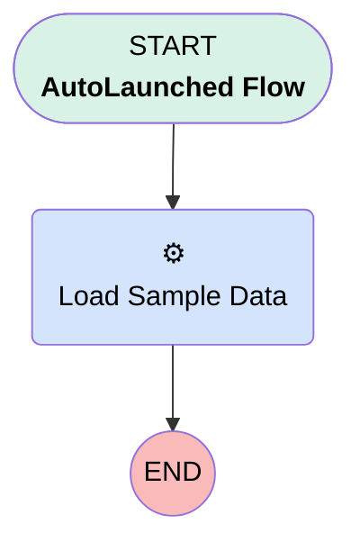

# Load Sample Data

## Flow Diagram [(_View History_)](Load_Sample_Data-history.md)

<!-- Flow description -->

## General Information

|<!-- -->|<!-- -->|
|:---|:---|
|Process Type| Auto Launched Flow|
|Label|Load Sample Data|
|Status|Active|
|Environments|Default|
|Interview Label|Load Sample Data {!$Flow.CurrentDateTime}|
| Builder Type (PM)|LightningFlowBuilder|
| Canvas Mode (PM)|AUTO_LAYOUT_CANVAS|
| Origin Builder Type (PM)|LightningFlowBuilder|
|Connector|[Load_Sample_Data](#load_sample_data)|
|Next Node|[Load_Sample_Data](#load_sample_data)|

## Flow Nodes Details

### Load_Sample_Data

|<!-- -->|<!-- -->|
|:---|:---|
|Type|Action Call|
|Label|Load Sample Data|
|Action Type|Apex|
|Action Name|[bot_DataController](../apex/bot_DataController.md)|
|Flow Transaction Model|CurrentTransaction|
|Name Segment|bot_DataController|

___

_Documentation generated from branch master by [sfdx-hardis](https://sfdx-hardis.cloudity.com), featuring [salesforce-flow-visualiser](https://github.com/toddhalfpenny/salesforce-flow-visualiser)_