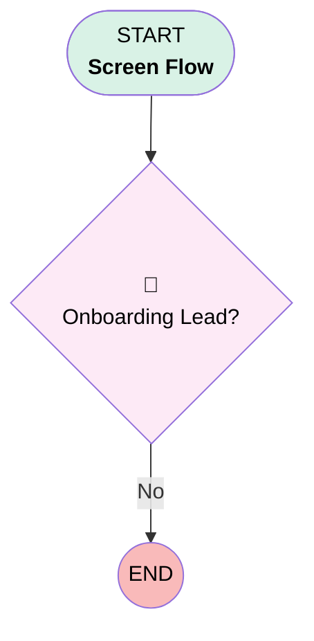

# Onboarding Project Initiation

## Flow Diagram [(_View History_)](Onboarding_Project_Initiation-history.md)

<!-- Flow description -->

## General Information

|<!-- -->|<!-- -->|
|:---|:---|
|Process Type| Flow|
|Label|Onboarding Project Initiation|
|Status|⚠️ Draft|
|Environments|Default|
|Interview Label|Onboarding Project Initiation {!$Flow.CurrentDateTime}|
| Builder Type (PM)|LightningFlowBuilder|
| Canvas Mode (PM)|AUTO_LAYOUT_CANVAS|
| Origin Builder Type (PM)|LightningFlowBuilder|
|Connector|[Onboarding_Lead](#onboarding_lead)|
|Next Node|[Onboarding_Lead](#onboarding_lead)|

## Flow Nodes Details

### Onboarding_Lead

|<!-- -->|<!-- -->|
|:---|:---|
|Type|Decision|
|Label|Onboarding Lead?|
|Default Connector Label|No|

#### Rule Favorite (Favorite)

|<!-- -->|<!-- -->|
|:---|:---|
|Condition Logic|and|

|Condition Id|Left Value Reference|Operator|Right Value|
|:-- |:-- |:--:|:--: |
|1|$Permission.Onboarding_Lead| Equal To|✅|

___

_Documentation generated from branch master by [sfdx-hardis](https://sfdx-hardis.cloudity.com), featuring [salesforce-flow-visualiser](https://github.com/toddhalfpenny/salesforce-flow-visualiser)_