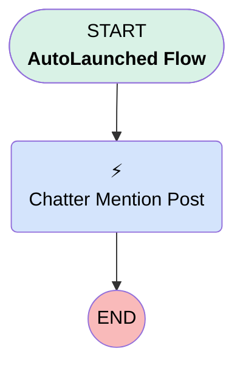

# Post to Chatter

## Flow Diagram [(_View History_)](Post_to_Chatter-history.md)

<!-- Flow description -->

## General Information

|<!-- -->|<!-- -->|
|:---|:---|
|Process Type| Auto Launched Flow|
|Label|Post to Chatter|
|Status|Active|
|Environments|Default|
|Interview Label|Post to Chatter {!$Flow.CurrentDateTime}|
| Builder Type (PM)|LightningFlowBuilder|
| Canvas Mode (PM)|AUTO_LAYOUT_CANVAS|
| Origin Builder Type (PM)|LightningFlowBuilder|
|Connector|[Chatter_Mention_Post](#chatter_mention_post)|
|Next Node|[Chatter_Mention_Post](#chatter_mention_post)|

## Variables

|Name|Data Type|Is Collection|Is Input|Is Output|Object Type|Description|
|:-- |:--:|:--:|:--:|:--:|:--:|:--  |
|chatterPostID|String|⬜|⬜|✅|<!-- -->|<!-- -->|
|postTargetID|String|⬜|✅|⬜|<!-- -->|<!-- -->|
|userMentionID|String|⬜|✅|⬜|<!-- -->|<!-- -->|

## Flow Nodes Details

### Chatter_Mention_Post

|<!-- -->|<!-- -->|
|:---|:---|
|Type|Action Call|
|Label|Chatter Mention Post|
|Action Type|Chatter Post|
|Action Name|chatterPost|
|Flow Transaction Model|CurrentTransaction|
|Name Segment|chatterPost|
|Offset|0|
|Output Parameters|assignToReference: chatterPostID name: feedItemId |
|Text (input)|chatterBody|
|Subject Name Or Id (input)|postTargetID|

___

_Documentation generated from branch master by [sfdx-hardis](https://sfdx-hardis.cloudity.com), featuring [salesforce-flow-visualiser](https://github.com/toddhalfpenny/salesforce-flow-visualiser)_

## Dependencies

- [Case_Priority_is_High](Case_Priority_is_High.md)
- [test_chatter](test_chatter.md)
