# Post to Chatter on Account Change en send email

## Flow Diagram [(_View History_)](Post_to_Chatter_on_Account_Change_en_send_email-history.md)

```mermaid
%% If you read this, your Markdown visualizer does not handle MermaidJS syntax.
%% - If you are in VsCode, install extension `Markdown Preview Mermaid Support` at https://marketplace.visualstudio.com/items?itemName=bierner.markdown-mermaid
%% - If you are using sfdx-hardis, try to define env variable `MERMAID_MODES=cli,docker` ,then run again the command to regenerate markdown with SVG images.
%% - If you are within mkdocs-material, define mermaid plugin in `mkdocs.yml` as described in https://squidfunk.github.io/mkdocs-material/extensions/mermaid/
%% - At last resort, you can copy-paste this MermaidJS code in https://mermaid.live/ to see the Flow Diagram

flowchart TB
START(["START<br/><b>AutoLaunched Flow</b></br>Type: <b> Record After Save</b>"]):::startClass
click START "#general-information" "1981332543"

Chatter_Notification("⚡ <em></em><br/>Chatter Notification"):::actionCalls
click Chatter_Notification "#chatter_notification" "4251502267"

Email_Account_Owner("📧 <em></em><br/>Email Account Owner"):::actionCalls
click Email_Account_Owner "#email_account_owner" "2638321249"

Chatter_Notification --> END_Chatter_Notification
Email_Account_Owner --> Chatter_Notification
START -->  Email_Account_Owner
END_Chatter_Notification(( END )):::endClass


classDef actionCalls fill:#D4E4FC,color:black,text-decoration:none,max-height:100px
classDef assignments fill:#FBEED7,color:black,text-decoration:none,max-height:100px
classDef collectionProcessors fill:#F0E3FA,color:black,text-decoration:none,max-height:100px
classDef customErrors fill:#FFE9E9,color:black,text-decoration:none,max-height:100px
classDef decisions fill:#FDEAF6,color:black,text-decoration:none,max-height:100px
classDef loops fill:#FDEAF6,color:black,text-decoration:none,max-height:100px
classDef recordCreates fill:#FFF8C9,color:black,text-decoration:none,max-height:100px
classDef recordDeletes fill:#FFF8C9,color:black,text-decoration:none,max-height:100px
classDef recordLookups fill:#EDEAFF,color:black,text-decoration:none,max-height:100px
classDef recordUpdates fill:#FFF8C9,color:black,text-decoration:none,max-height:100px
classDef screens fill:#DFF6FF,color:black,text-decoration:none,max-height:100px
classDef subflows fill:#D4E4FC,color:black,text-decoration:none,max-height:100px
classDef startClass fill:#D9F2E6,color:black,text-decoration:none,max-height:100px
classDef endClass fill:#F9BABA,color:black,text-decoration:none,max-height:100px


```

<!-- Flow description -->

## General Information

|<!-- -->|<!-- -->|
|:---|:---|
|Object|Account|
|Process Type| Auto Launched Flow|
|Trigger Type| Record After Save|
|Record Trigger Type| Update|
|Label|Post to Chatter on Account Change en send email|
|Status|Active|
|Environments|Default|
|Interview Label|Post to Chatter on Account Change en send email {!$Flow.CurrentDateTime}|
| Builder Type (PM)|LightningFlowBuilder|
| Canvas Mode (PM)|AUTO_LAYOUT_CANVAS|
| Origin Builder Type (PM)|LightningFlowBuilder|
|Connector|[Email_Account_Owner](#email_account_owner)|
|Next Node|[Email_Account_Owner](#email_account_owner)|

#### Filters (logic: **or**)

|Filter Id|Field|Operator|Value|
|:-- |:-- |:--:|:--: |
|1|AccountNumber| Is Changed|✅|
|2|AnnualRevenue| Is Changed|✅|
|3|Name| Is Changed|✅|
|4|Rating| Is Changed|✅|

## Flow Nodes Details

### Chatter_Notification

|<!-- -->|<!-- -->|
|:---|:---|
|Type|Action Call|
|Label|Chatter Notification|
|Action Type|Chatter Post|
|Action Name|chatterPost|
|Flow Transaction Model|CurrentTransaction|
|Name Segment|chatterPost|
|Store Output Automatically|✅|
|Text (input)|ChatterBody|
|Subject Name Or Id (input)|$Record.Owner.Username|
|Type (input)| User|

### Email_Account_Owner

|<!-- -->|<!-- -->|
|:---|:---|
|Type|Action Call|
|Label|Email Account Owner|
|Action Type|Email Alert|
|Action Name|Account.Notify_Owner_of_Account_Change|
|Flow Transaction Model|CurrentTransaction|
|Name Segment|Account.Notify_Owner_of_Account_Change|
| SObject Row Id (input)|$Record.Id|
|Connector|[Chatter_Notification](#chatter_notification)|

___

_Documentation generated from branch master by [sfdx-hardis](https://sfdx-hardis.cloudity.com), featuring [salesforce-flow-visualiser](https://github.com/toddhalfpenny/salesforce-flow-visualiser)_