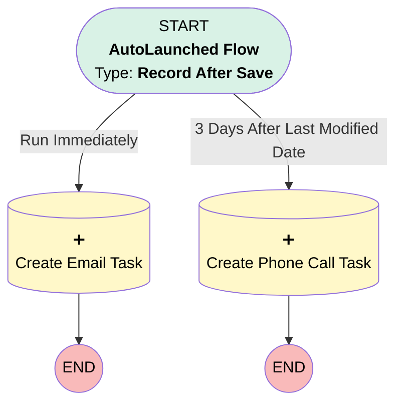

# Review Opportunity with Account Owner

## Flow Diagram [(_View History_)](Review_Opportunity_with_Account_Owner-history.md)

<!-- Flow description -->

## General Information

|<!-- -->|<!-- -->|
|:---|:---|
|Object|Opportunity|
|Process Type| Auto Launched Flow|
|Trigger Type| Record After Save|
|Record Trigger Type| Create And Update|
|Label|Review Opportunity with Account Owner|
|Status|⚠️ Draft|
|Does Require Record Changed To Meet Criteria|✅|
|Description|When a high-value opportunity is ready for negotiation and review, create a task for the owner to follow up with the account owner|
|Environments|Default|
|Interview Label|Review Opportunity with Account Owner {!$Flow.CurrentDateTime}|
| Builder Type (PM)|LightningFlowBuilder|
| Canvas Mode (PM)|AUTO_LAYOUT_CANVAS|
| Origin Builder Type (PM)|LightningFlowBuilder|
|Connector|[Create_Email_Task](#create_email_task)|
|Next Node|[Create_Email_Task](#create_email_task)|

#### Scheduled Paths

|Label|Name|Offset Number|Offset Unit|Record Field|Time Source|Connector|
|:-- |:-- |:-- |:-- |:-- |:-- |:--  |
|3 Days After Last Modified Date|X3_Days_After_Last_Modified_Date|3|Days|LastModifiedDate|RecordField|[Create_Phone_Call_Task](#create_phone_call_task)|

#### Filters (logic: **and**)

|Filter Id|Field|Operator|Value|
|:-- |:-- |:--:|:--: |
|1|StageName| Equal To|Negotiation/Review|
|2|Amount| Greater Than|100000|

## Flow Nodes Details

### Create_Email_Task

|<!-- -->|<!-- -->|
|:---|:---|
|Type|Record Create|
|Object|Task|
|Label|Create Email Task|
|Description|Create a task for the opportunity owner to send a follow email to the account owner today|
|Store Output Automatically|✅|

#### Input Assignments

|Field|Value|
|:-- |:--: |
|ActivityDate|dateValue: '2024-01-21' |
|OwnerId|$Record.OwnerId|
|Subject|Follow up with the account owner by email|
|WhatId|$Record.AccountId|

### Create_Phone_Call_Task

|<!-- -->|<!-- -->|
|:---|:---|
|Type|Record Create|
|Object|Task|
|Label|Create Phone Call Task|
|Description|Create a task for the opportunity owner to check in with the customer by phone|
|Store Output Automatically|✅|

#### Input Assignments

|Field|Value|
|:-- |:--: |
|ActivityDate|dateValue: '2024-01-21' |
|Description|Call to check in with the customer|
|OwnerId|$Record.OwnerId|
|Subject|Outreach phone call|
|WhatId|$Record.Id|

___

_Documentation generated from branch master by [sfdx-hardis](https://sfdx-hardis.cloudity.com), featuring [salesforce-flow-visualiser](https://github.com/toddhalfpenny/salesforce-flow-visualiser)_