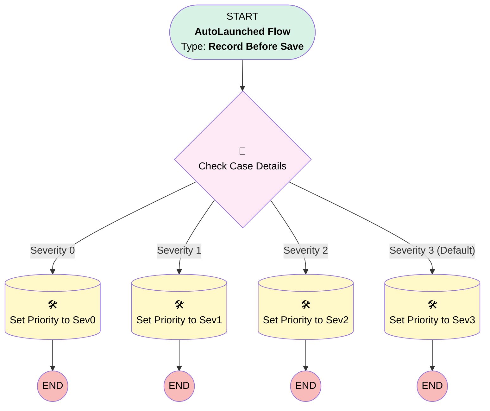

# Set Case Priority

## Flow Diagram [(_View History_)](Set_Case_Priority-history.md)

<!-- Flow description -->

## General Information

|<!-- -->|<!-- -->|
|:---|:---|
|Object|Case|
|Process Type| Auto Launched Flow|
|Trigger Type| Record Before Save|
|Record Trigger Type| Create|
|Label|Set Case Priority|
|Status|⚠️ Draft|
|Environments|Default|
|Interview Label|Set Case Priority {!$Flow.CurrentDateTime}|
| Builder Type (PM)|LightningFlowBuilder|
| Canvas Mode (PM)|AUTO_LAYOUT_CANVAS|
| Origin Builder Type (PM)|LightningFlowBuilder|
|Connector|[Check_Case_Details](#check_case_details)|
|Next Node|[Check_Case_Details](#check_case_details)|

## Flow Nodes Details

### Check_Case_Details

|<!-- -->|<!-- -->|
|:---|:---|
|Type|Decision|
|Label|Check Case Details|
|Default Connector|[Set_Priority_to_Sev3](#set_priority_to_sev3)|
|Default Connector Label|Severity 3 (Default)|

#### Rule Severity_0 (Severity 0)

|<!-- -->|<!-- -->|
|:---|:---|
|Connector|[Set_Priority_to_Sev0](#set_priority_to_sev0)|
|Condition Logic|and|

|Condition Id|Left Value Reference|Operator|Right Value|
|:-- |:-- |:--:|:--: |
|1|$Record.Type| Equal To|Downtime|

#### Rule Severity_1 (Severity 1)

|<!-- -->|<!-- -->|
|:---|:---|
|Connector|[Set_Priority_to_Sev1](#set_priority_to_sev1)|
|Condition Logic|and|

|Condition Id|Left Value Reference|Operator|Right Value|
|:-- |:-- |:--:|:--: |
|1|$Record.Type| Equal To|Usability|
|2|$Record.Contact.Description| Contains|VIP|

#### Rule Severity_2 (Severity 2)

|<!-- -->|<!-- -->|
|:---|:---|
|Connector|[Set_Priority_to_Sev2](#set_priority_to_sev2)|
|Condition Logic|and|

|Condition Id|Left Value Reference|Operator|Right Value|
|:-- |:-- |:--:|:--: |
|1|$Record.Type| Equal To|Usability|

### Set_Priority_to_Sev0

|<!-- -->|<!-- -->|
|:---|:---|
|Type|Record Update|
|Label|Set Priority to Sev0|
|Input Reference|$Record|

#### Input Assignments

|Field|Value|
|:-- |:--: |
|Priority|Severity 0|

### Set_Priority_to_Sev1

|<!-- -->|<!-- -->|
|:---|:---|
|Type|Record Update|
|Label|Set Priority to Sev1|
|Input Reference|$Record|

#### Input Assignments

|Field|Value|
|:-- |:--: |
|Priority|Severity 1|

### Set_Priority_to_Sev2

|<!-- -->|<!-- -->|
|:---|:---|
|Type|Record Update|
|Label|Set Priority to Sev2|
|Input Reference|$Record|

#### Input Assignments

|Field|Value|
|:-- |:--: |
|Priority|Severity 2|

### Set_Priority_to_Sev3

|<!-- -->|<!-- -->|
|:---|:---|
|Type|Record Update|
|Label|Set Priority to Sev3|
|Input Reference|$Record|

#### Input Assignments

|Field|Value|
|:-- |:--: |
|Priority|Severity 3|

___

_Documentation generated from branch master by [sfdx-hardis](https://sfdx-hardis.cloudity.com), featuring [salesforce-flow-visualiser](https://github.com/toddhalfpenny/salesforce-flow-visualiser)_