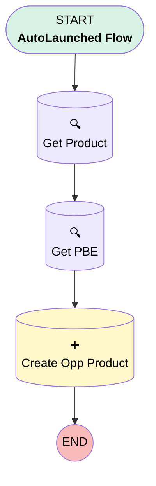

# Subflow-Create Generator Opp Product

## Flow Diagram [(_View History_)](Subflow_Create_Generator_Opp_Product-history.md)

<!-- Flow description -->

## General Information

|<!-- -->|<!-- -->|
|:---|:---|
|Process Type| Auto Launched Flow|
|Label|Subflow-Create Generator Opp Product|
|Status|Active|
|Environments|Default|
|Interview Label|Subflow-Create Generator Opp Product {!$Flow.CurrentDateTime}|
| Builder Type (PM)|LightningFlowBuilder|
| Canvas Mode (PM)|AUTO_LAYOUT_CANVAS|
| Origin Builder Type (PM)|LightningFlowBuilder|
|Connector|[Get_Product](#get_product)|
|Next Node|[Get_Product](#get_product)|

## Variables

|Name|Data Type|Is Collection|Is Input|Is Output|Object Type|Description|
|:-- |:--:|:--:|:--:|:--:|:--:|:--  |
|OpportunityID|String|⬜|✅|⬜|<!-- -->|<!-- -->|
|PricebookID|String|⬜|✅|⬜|<!-- -->|<!-- -->|
|ProductKW|String|⬜|✅|⬜|<!-- -->|<!-- -->|

## Flow Nodes Details

### Create_Opp_Product

|<!-- -->|<!-- -->|
|:---|:---|
|Type|Record Create|
|Object|OpportunityLineItem|
|Label|Create Opp Product|
|Store Output Automatically|✅|

#### Input Assignments

|Field|Value|
|:-- |:--: |
|OpportunityId|OpportunityID|
|PricebookEntryId|Get_PBE.Id|
|Quantity|1|
|TotalPrice|Get_PBE.UnitPrice|

### Get_PBE

|<!-- -->|<!-- -->|
|:---|:---|
|Type|Record Lookup|
|Object|PricebookEntry|
|Label|Get PBE|
|Assign Null Values If No Records Found|⬜|
|Get First Record Only|✅|
|Store Output Automatically|✅|
|Connector|[Create_Opp_Product](#create_opp_product)|

#### Filters (logic: **and**)

|Filter Id|Field|Operator|Value|
|:-- |:-- |:--:|:--: |
|1|Pricebook2Id| Equal To|PricebookID|
|2|Product2Id| Equal To|Get_Product.Id|

### Get_Product

|<!-- -->|<!-- -->|
|:---|:---|
|Type|Record Lookup|
|Object|Product2|
|Label|Get Product|
|Assign Null Values If No Records Found|⬜|
|Get First Record Only|✅|
|Store Output Automatically|✅|
|Connector|[Get_PBE](#get_pbe)|

#### Filters (logic: **and**)

|Filter Id|Field|Operator|Value|
|:-- |:-- |:--:|:--: |
|1|Name| Contains|ProductKW|

___

_Documentation generated from branch master by [sfdx-hardis](https://sfdx-hardis.cloudity.com), featuring [salesforce-flow-visualiser](https://github.com/toddhalfpenny/salesforce-flow-visualiser)_

## Dependencies

- [Add_Generator_Product_to_Named_Opps](Add_Generator_Product_to_Named_Opps.md)
