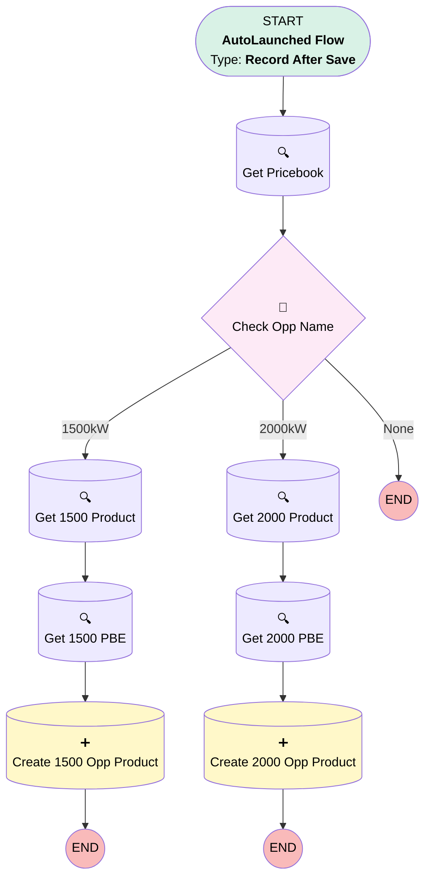

# test

## Flow Diagram [(_View History_)](test-history.md)

<!-- Flow description -->

## General Information

|<!-- -->|<!-- -->|
|:---|:---|
|Object|Opportunity|
|Process Type| Auto Launched Flow|
|Trigger Type| Record After Save|
|Record Trigger Type| Create|
|Label|test|
|Status|Active|
|Environments|Default|
|Interview Label|test {!$Flow.CurrentDateTime}|
| Builder Type (PM)|LightningFlowBuilder|
| Canvas Mode (PM)|AUTO_LAYOUT_CANVAS|
| Origin Builder Type (PM)|LightningFlowBuilder|
|Connector|[Get_Pricebook](#get_pricebook)|
|Next Node|[Get_Pricebook](#get_pricebook)|

## Flow Nodes Details

### Check_Opp_Name

|<!-- -->|<!-- -->|
|:---|:---|
|Type|Decision|
|Label|Check Opp Name|
|Default Connector Label|None|

#### Rule X1500kW (1500kW)

|<!-- -->|<!-- -->|
|:---|:---|
|Connector|[Get_1500_Product](#get_1500_product)|
|Condition Logic|and|

|Condition Id|Left Value Reference|Operator|Right Value|
|:-- |:-- |:--:|:--: |
|1|$Record.Name| Contains|1500|

#### Rule X2000kW (2000kW)

|<!-- -->|<!-- -->|
|:---|:---|
|Connector|[Get_2000_Product](#get_2000_product)|
|Condition Logic|and|

|Condition Id|Left Value Reference|Operator|Right Value|
|:-- |:-- |:--:|:--: |
|1|$Record.Name| Contains|2000|

### Create_1500_Opp_Product

|<!-- -->|<!-- -->|
|:---|:---|
|Type|Record Create|
|Object|OpportunityLineItem|
|Label|Create 1500 Opp Product|
|Description|create opportunity product|
|Store Output Automatically|✅|

#### Input Assignments

|Field|Value|
|:-- |:--: |
|OpportunityId|$Record.Id|
|PricebookEntryId|Get_1500_PBE.Id|
|Quantity|1|
|TotalPrice|Get_1500_PBE.UnitPrice|

### Create_2000_Opp_Product

|<!-- -->|<!-- -->|
|:---|:---|
|Type|Record Create|
|Object|OpportunityLineItem|
|Label|Create 2000 Opp Product|
|Store Output Automatically|✅|

#### Input Assignments

|Field|Value|
|:-- |:--: |
|OpportunityId|$Record.Id|
|PricebookEntryId|Get_2000_PBE.Id|
|Quantity|1|
|TotalPrice|Get_2000_PBE.UnitPrice|

### Get_1500_PBE

|<!-- -->|<!-- -->|
|:---|:---|
|Type|Record Lookup|
|Object|PricebookEntry|
|Label|Get 1500 PBE|
|Assign Null Values If No Records Found|⬜|
|Get First Record Only|✅|
|Store Output Automatically|✅|
|Connector|[Create_1500_Opp_Product](#create_1500_opp_product)|

#### Filters (logic: **and**)

|Filter Id|Field|Operator|Value|
|:-- |:-- |:--:|:--: |
|1|Pricebook2Id| Equal To|Get_Pricebook.Id|
|2|Product2Id| Equal To|Get_1500_Product.Id|

### Get_1500_Product

|<!-- -->|<!-- -->|
|:---|:---|
|Type|Record Lookup|
|Object|Product2|
|Label|Get 1500 Product|
|Assign Null Values If No Records Found|⬜|
|Get First Record Only|✅|
|Store Output Automatically|✅|
|Connector|[Get_1500_PBE](#get_1500_pbe)|

#### Filters (logic: **and**)

|Filter Id|Field|Operator|Value|
|:-- |:-- |:--:|:--: |
|1|Name| Contains|1500|

### Get_2000_PBE

|<!-- -->|<!-- -->|
|:---|:---|
|Type|Record Lookup|
|Object|PricebookEntry|
|Label|Get 2000 PBE|
|Assign Null Values If No Records Found|⬜|
|Get First Record Only|✅|
|Store Output Automatically|✅|
|Connector|[Create_2000_Opp_Product](#create_2000_opp_product)|

#### Filters (logic: **and**)

|Filter Id|Field|Operator|Value|
|:-- |:-- |:--:|:--: |
|1|Pricebook2Id| Equal To|Get_Pricebook.Id|
|2|Product2Id| Equal To|Get_2000_Product.Id|

### Get_2000_Product

|<!-- -->|<!-- -->|
|:---|:---|
|Type|Record Lookup|
|Object|Product2|
|Label|Get 2000 Product|
|Assign Null Values If No Records Found|⬜|
|Get First Record Only|✅|
|Store Output Automatically|✅|
|Connector|[Get_2000_PBE](#get_2000_pbe)|

#### Filters (logic: **and**)

|Filter Id|Field|Operator|Value|
|:-- |:-- |:--:|:--: |
|1|Name| Contains|2000|

### Get_Pricebook

|<!-- -->|<!-- -->|
|:---|:---|
|Type|Record Lookup|
|Object|Pricebook2|
|Label|Get Pricebook|
|Assign Null Values If No Records Found|⬜|
|Get First Record Only|✅|
|Store Output Automatically|✅|
|Connector|[Check_Opp_Name](#check_opp_name)|

#### Filters (logic: **and**)

|Filter Id|Field|Operator|Value|
|:-- |:-- |:--:|:--: |
|1|Name| Equal To|Standard Price Book|

___

_Documentation generated from branch master by [sfdx-hardis](https://sfdx-hardis.cloudity.com), featuring [salesforce-flow-visualiser](https://github.com/toddhalfpenny/salesforce-flow-visualiser)_