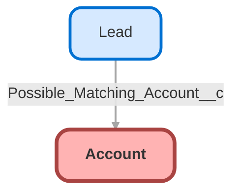

---
hide:
  - path
---

## Schema

<!-- Object description -->

## Fields

| Name      | Label | Type | Description |
| :-------- | :---- | :--: | :---------- | 
| AccountNumber |  |  | <!-- --> |
| AccountSource |  | Picklist | <!-- --> |
| Active__c | Active | Picklist | <!-- --> |
| AnnualRevenue |  |  | <!-- --> |
| BillingAddress |  |  | <!-- --> |
| CleanStatus |  |  | <!-- --> |
| CurrencyIsoCode |  |  | <!-- --> |
| Customer_ID__c | Customer ID | Text | <!-- --> |
| CustomerPriority__c | Customer Priority | Picklist | <!-- --> |
| DandbCompanyId |  | Lookup | <!-- --> |
| Description |  |  | <!-- --> |
| DunsNumber |  |  | <!-- --> |
| Fax |  |  | <!-- --> |
| First_Name__c | First Name | Text | <!-- --> |
| Founding_Date__c | Founding Date | Date | <!-- --> |
| Industry |  | Picklist | <!-- --> |
| IsExcludedFromRealign |  |  | <!-- --> |
| Jigsaw |  |  | <!-- --> |
| Last_Name__c | Last Name | Text | <!-- --> |
| Match_Billing_Address__c | Match Billing Address | Checkbox | <!-- --> |
| NaicsCode |  |  | <!-- --> |
| NaicsDesc |  |  | <!-- --> |
| Name |  |  | <!-- --> |
| Number_Of_Contacts__c | Number Of Contacts | Number | <!-- --> |
| NumberOfEmployees |  |  | <!-- --> |
| NumberofLocations__c | Number of Locations | Number | <!-- --> |
| OperatingHoursId |  | Lookup | <!-- --> |
| OwnerId |  | Lookup | <!-- --> |
| Ownership |  | Picklist | <!-- --> |
| ParentId |  | Hierarchy | <!-- --> |
| Phone |  |  | <!-- --> |
| Rating |  | Picklist | <!-- --> |
| SB_Test__c | SB_Test | Checkbox | test de checkbox |
| ShippingAddress |  |  | <!-- --> |
| Sic |  |  | <!-- --> |
| SicDesc |  |  | <!-- --> |
| Site |  |  | <!-- --> |
| SLA__c | SLA | Picklist | <!-- --> |
| SLAExpirationDate__c | SLA Expiration Date | Date | <!-- --> |
| SLASerialNumber__c | SLA Serial Number | Text | <!-- --> |
| StartDate__c | StartDate | Date | <!-- --> |
| TickerSymbol |  |  | <!-- --> |
| Tier |  |  | <!-- --> |
| Top_Account__c | Top Account | Checkbox | <!-- --> |
| Tradestyle |  |  | <!-- --> |
| Type |  | Picklist | <!-- --> |
| UpsellOpportunity__c | Upsell Opportunity | Picklist | <!-- --> |
| Website |  |  | <!-- --> |
| YearStarted |  |  | <!-- --> |

## Related Flows

| Object | Name      | Type | Description |
| :----  | :-------- | :--: | :---------- | 
| 💻 | [Convert_to_Customer](../flows/Convert_to_Customer.md) [🕒](../flows/Convert_to_Customer-history.md) |  Auto Launched Flow | <!-- --> |
| 💻 | [Fetch_Related_Records](../flows/Fetch_Related_Records.md) [🕒](../flows/Fetch_Related_Records-history.md) |  Screen Flow | <!-- --> |
| Account | [Create_Follow_Up_on_New_Prospect](../flows/Create_Follow_Up_on_New_Prospect.md) [🕒](../flows/Create_Follow_Up_on_New_Prospect-history.md) |  Record After Save | <!-- --> |
| Account | [Post_to_Chatter_on_Account_Change_en_send_email](../flows/Post_to_Chatter_on_Account_Change_en_send_email.md) [🕒](../flows/Post_to_Chatter_on_Account_Change_en_send_email-history.md) |  Record After Save | <!-- --> |
| Account | [test2](../flows/test2.md) [🕒](../flows/test2-history.md) |  Record After Save | <!-- --> |
| Lead | [Check_New_Lead_for_Matching_Account](../flows/Check_New_Lead_for_Matching_Account.md) [🕒](../flows/Check_New_Lead_for_Matching_Account-history.md) |  Record After Save | <!-- --> |
| Opportunity | [Add_VIP_to_Description](../flows/Add_VIP_to_Description.md) [🕒](../flows/Add_VIP_to_Description-history.md) |  Record After Save | <!-- --> |

## Related Apex Classes

| Apex Class | Type |
| :----      | :--: | 
| [AccountHandler](../apex/AccountHandler.md) | Class |
| [AccountService](../apex/AccountService.md) | Class |
| [AccountServiceTest](../apex/AccountServiceTest.md) | Test |
| [CaseOnAccountTest](../apex/CaseOnAccountTest.md) | Test |
| [DataGenerationTest](../apex/DataGenerationTest.md) | Test |
| [LightningConnectQuickstart](../apex/LightningConnectQuickstart.md) | Class |
| [OlderAccountsUtility](../apex/OlderAccountsUtility.md) | Class |
| [TestFactory](../apex/TestFactory.md) | Test |
| [TestLightningConnectQuickstart](../apex/TestLightningConnectQuickstart.md) | Test |
| [bot_DataController](../apex/bot_DataController.md) | Invocable |

## Related Lightning Pages

| Lightning Page | Type |
| :----      | :--: | 
| [Account_Record_Page](../pages/Account_Record_Page.md) |  Record Page |
| [Contact_Record_Page](../pages/Contact_Record_Page.md) |  Record Page |
| [botanicals_home_page](../pages/botanicals_home_page.md) |  Home Page |

_Documentation generated with [sfdx-hardis](https://sfdx-hardis.cloudity.com)_
