---
hide:
  - path
---

## Schema

```mermaid
graph TD
AgentWork["AgentWork"]:::mainObject
click AgentWork "/objects/AgentWork/"


classDef object fill:#D6E9FF,stroke:#0070D2,stroke-width:3px,rx:12px,ry:12px,shadow:drop,color:#333;
classDef customObject fill:#FFF4C2,stroke:#CCAA00,stroke-width:3px,rx:12px,ry:12px,shadow:drop,color:#333;
classDef customObjectManaged fill:#FFD8B2,stroke:#CC5500,stroke-width:3px,rx:12px,ry:12px,shadow:drop,color:#333;
classDef mainObject fill:#FFB3B3,stroke:#A94442,stroke-width:4px,rx:14px,ry:14px,shadow:drop,color:#333,font-weight:bold;

```

<!-- Object description -->

## Fields

| Name      | Label | Type | Description |
| :-------- | :---- | :--: | :---------- | 
| AcceptDateTime |  |  | <!-- --> |
| ActiveTime |  |  | <!-- --> |
| AcwExtensionCount |  |  | <!-- --> |
| AcwExtensionDuration |  |  | <!-- --> |
| AfterConversationActualTime |  |  | <!-- --> |
| AgentCapacityWhenDeclined |  |  | <!-- --> |
| AgentIntCapacityWhenDeclined |  |  | <!-- --> |
| CancelDateTime |  |  | <!-- --> |
| CapacityModel |  |  | <!-- --> |
| CapacityPercentage |  |  | <!-- --> |
| CapacityWeight |  |  | <!-- --> |
| ChannelData |  |  | <!-- --> |
| CloseDateTime |  |  | <!-- --> |
| DeclineDateTime |  |  | <!-- --> |
| DeclineReason |  |  | <!-- --> |
| FlagIcon |  |  | <!-- --> |
| FlagMessage |  |  | <!-- --> |
| HandleTime |  |  | <!-- --> |
| HasNotification |  |  | <!-- --> |
| IsAutoAcceptEnabled |  |  | <!-- --> |
| IsConference |  |  | <!-- --> |
| IsFallback |  |  | <!-- --> |
| IsFlagged |  |  | <!-- --> |
| IsFlagSupervisorOnly |  |  | <!-- --> |
| IsInterruptible |  |  | <!-- --> |
| IsOwnerChangeInitiated |  |  | <!-- --> |
| IsPreferredUserRequired |  |  | <!-- --> |
| IsStatusChangeInitiated |  |  | <!-- --> |
| IsTransfer |  |  | <!-- --> |
| LASessionId |  |  | <!-- --> |
| OriginalQueueId |  | Lookup | <!-- --> |
| OwnerId |  | Lookup | <!-- --> |
| PausedCapacityPercentage |  |  | <!-- --> |
| PausedCapacityWeight |  |  | <!-- --> |
| PendingServiceRoutingId |  | Lookup | <!-- --> |
| PreferredUserId |  | Lookup | <!-- --> |
| PushTimeout |  |  | <!-- --> |
| PushTimeoutDateTime |  |  | <!-- --> |
| RequestDateTime |  |  | <!-- --> |
| RoutingModel |  |  | <!-- --> |
| RoutingPriority |  |  | <!-- --> |
| RoutingType |  |  | <!-- --> |
| SecondaryRoutingPriority |  |  | <!-- --> |
| ServiceChannelId |  | Lookup | <!-- --> |
| ShouldSkipCapacityCheck |  |  | <!-- --> |
| ShouldSkipChannelCheck |  |  | <!-- --> |
| SpeedToAnswer |  |  | <!-- --> |
| Status |  |  | <!-- --> |
| StatusSequence |  |  | <!-- --> |
| TransferRequesterId |  | Lookup | <!-- --> |
| UserId |  | Lookup | <!-- --> |
| WorkItemId |  | Lookup | <!-- --> |
| WorkItemStatus |  |  | <!-- --> |

_Documentation generated with [sfdx-hardis](https://sfdx-hardis.cloudity.com)_
