---
hide:
  - path
---

## Schema

```mermaid
graph TD
Asset["Asset"]:::mainObject
click Asset "/objects/Asset/"


classDef object fill:#D6E9FF,stroke:#0070D2,stroke-width:3px,rx:12px,ry:12px,shadow:drop,color:#333;
classDef customObject fill:#FFF4C2,stroke:#CCAA00,stroke-width:3px,rx:12px,ry:12px,shadow:drop,color:#333;
classDef customObjectManaged fill:#FFD8B2,stroke:#CC5500,stroke-width:3px,rx:12px,ry:12px,shadow:drop,color:#333;
classDef mainObject fill:#FFB3B3,stroke:#A94442,stroke-width:4px,rx:14px,ry:14px,shadow:drop,color:#333,font-weight:bold;

```

<!-- Object description -->

## Fields

| Name      | Label | Type | Description |
| :-------- | :---- | :--: | :---------- | 
| AccountId |  | Lookup | <!-- --> |
| Address |  |  | <!-- --> |
| AssetLevel |  |  | <!-- --> |
| AssetProvidedById |  | Lookup | <!-- --> |
| AssetServicedById |  | Lookup | <!-- --> |
| ConsequenceOfFailure |  | Picklist | <!-- --> |
| ContactId |  | Lookup | <!-- --> |
| CurrencyIsoCode |  |  | <!-- --> |
| CurrentAmount |  |  | <!-- --> |
| CurrentLifecycleEndDate |  |  | <!-- --> |
| CurrentMrr |  |  | <!-- --> |
| CurrentQuantity |  |  | <!-- --> |
| Description |  |  | <!-- --> |
| DigitalAssetStatus |  | Picklist | <!-- --> |
| ExternalIdentifier |  |  | <!-- --> |
| HasLifecycleManagement |  |  | <!-- --> |
| InstallDate |  |  | <!-- --> |
| IsCompetitorProduct |  |  | <!-- --> |
| IsInternal |  |  | <!-- --> |
| LifecycleEndDate |  |  | <!-- --> |
| LifecycleStartDate |  |  | <!-- --> |
| LocationId |  | Lookup | <!-- --> |
| ManufactureDate |  |  | <!-- --> |
| Name |  |  | <!-- --> |
| OwnerId |  | Lookup | <!-- --> |
| ParentId |  | Lookup | <!-- --> |
| Price |  |  | <!-- --> |
| Product2Id |  | Lookup | <!-- --> |
| ProductCode |  |  | <!-- --> |
| ProductDescription |  |  | <!-- --> |
| ProductFamily |  | Picklist | <!-- --> |
| PurchaseDate |  |  | <!-- --> |
| Quantity |  |  | <!-- --> |
| RootAssetId |  | Lookup | <!-- --> |
| SerialNumber |  |  | <!-- --> |
| Status |  | Picklist | <!-- --> |
| StatusReason |  | Picklist | <!-- --> |
| StockKeepingUnit |  |  | <!-- --> |
| TotalLifecycleAmount |  |  | <!-- --> |
| UsageEndDate |  |  | <!-- --> |
| Uuid |  |  | <!-- --> |

_Documentation generated with [sfdx-hardis](https://sfdx-hardis.cloudity.com)_
