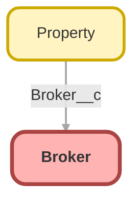

---
hide:
  - path
---

## Schema

<!-- Object description -->

## Fields

| Name      | Label | Type | Description |
| :-------- | :---- | :--: | :---------- | 
| Broker_Id__c | Broker Id | Number | <!-- --> |
| Email__c | Email | Email | <!-- --> |
| Mobile_Phone__c | Mobile Phone | Phone | <!-- --> |
| Phone__c | Phone | Phone | <!-- --> |
| Picture__c | Picture | Url | <!-- --> |
| Picture_IMG__c | Picture | Text | <!-- --> |
| Title__c | Title | Text | <!-- --> |

## Related Flows

| Object | Name      | Type | Description |
| :----  | :-------- | :--: | :---------- | 
| 💻 | [Create_property](../flows/Create_property.md) [🕒](../flows/Create_property-history.md) |  Screen Flow | This flow helps agents creating new properties in just a few clicks. It calculates the geocoded address calling out to a 3rd party service. |

## Related Apex Classes

| Apex Class | Type |
| :----      | :--: | 
| [SampleDataController](../apex/SampleDataController.md) | Lightning Controller |
| [TestSampleDataController](../apex/TestSampleDataController.md) | Test |

## Related Lightning Pages

| Lightning Page | Type |
| :----      | :--: | 
| [Broker_Record_Page](../pages/Broker_Record_Page.md) |  Record Page |

_Documentation generated with [sfdx-hardis](https://sfdx-hardis.cloudity.com)_
