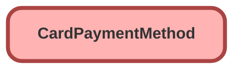

---
hide:
  - path
---

## Schema

<!-- Object description -->

## Fields

| Name      | Label | Type | Description |
| :-------- | :---- | :--: | :---------- | 
| AccountId |  | Lookup | <!-- --> |
| AuditEmail |  |  | <!-- --> |
| AutoCardType |  |  | <!-- --> |
| CardBin |  |  | <!-- --> |
| CardCategory |  |  | <!-- --> |
| CardHolderFirstName |  |  | <!-- --> |
| CardHolderLastName |  |  | <!-- --> |
| CardHolderName |  |  | <!-- --> |
| CardLastFour |  |  | <!-- --> |
| CardType |  | Picklist | <!-- --> |
| Comments |  |  | <!-- --> |
| CompanyName |  |  | <!-- --> |
| DisplayCardNumber |  |  | <!-- --> |
| Email |  |  | <!-- --> |
| ExpiryMonth |  |  | <!-- --> |
| ExpiryYear |  |  | <!-- --> |
| GatewayDate |  |  | <!-- --> |
| GatewayResultCode |  |  | <!-- --> |
| GatewayResultCodeDescription |  |  | <!-- --> |
| GatewayToken |  |  | <!-- --> |
| GatewayTokenDetails |  |  | <!-- --> |
| GatewayTokenEncrypted |  |  | <!-- --> |
| InputCardNumber |  |  | <!-- --> |
| IpAddress |  |  | <!-- --> |
| IsAutoPayEnabled |  |  | <!-- --> |
| MacAddress |  |  | <!-- --> |
| NickName |  |  | <!-- --> |
| PaymentGatewayId |  | Lookup | <!-- --> |
| PaymentMethodDetails |  |  | <!-- --> |
| PaymentMethodSubType |  |  | <!-- --> |
| PaymentMethodType |  |  | <!-- --> |
| Phone |  |  | <!-- --> |
| ProcessingMode |  |  | <!-- --> |
| SfResultCode |  |  | <!-- --> |
| StartMonth |  |  | <!-- --> |
| StartYear |  |  | <!-- --> |
| Status |  |  | <!-- --> |

_Documentation generated with [sfdx-hardis](https://sfdx-hardis.cloudity.com)_
