---
hide:
  - path
---

## Schema

```mermaid
graph TD
Case["Case"]:::mainObject
click Case "/objects/Case/"


classDef object fill:#D6E9FF,stroke:#0070D2,stroke-width:3px,rx:12px,ry:12px,shadow:drop,color:#333;
classDef customObject fill:#FFF4C2,stroke:#CCAA00,stroke-width:3px,rx:12px,ry:12px,shadow:drop,color:#333;
classDef customObjectManaged fill:#FFD8B2,stroke:#CC5500,stroke-width:3px,rx:12px,ry:12px,shadow:drop,color:#333;
classDef mainObject fill:#FFB3B3,stroke:#A94442,stroke-width:4px,rx:14px,ry:14px,shadow:drop,color:#333,font-weight:bold;

```

<!-- Object description -->

## Fields

| Name      | Label | Type | Description |
| :-------- | :---- | :--: | :---------- | 
| AccountId |  | Lookup | <!-- --> |
| AssetId |  | Lookup | <!-- --> |
| BusinessHoursId |  | Lookup | <!-- --> |
| ClosedDate |  |  | <!-- --> |
| Comments |  |  | <!-- --> |
| ContactEmail |  |  | <!-- --> |
| ContactFax |  |  | <!-- --> |
| ContactId |  | Lookup | <!-- --> |
| ContactMobile |  |  | <!-- --> |
| ContactPhone |  |  | <!-- --> |
| CurrencyIsoCode |  |  | <!-- --> |
| Description |  |  | <!-- --> |
| EngineeringReqNumber__c | Engineering Req Number | Text | <!-- --> |
| EntitlementId |  | Lookup | <!-- --> |
| Has_Extended_Warranty__c | Has Extended Warranty | Checkbox | <!-- --> |
| IsClosedOnCreate |  |  | <!-- --> |
| IsEscalated |  |  | <!-- --> |
| IsStopped |  |  | <!-- --> |
| MilestoneStatus |  |  | <!-- --> |
| MilestoneStatusIcon |  |  | <!-- --> |
| Origin |  | Picklist | <!-- --> |
| OwnerId |  | Lookup | <!-- --> |
| ParentId |  | Lookup | <!-- --> |
| PotentialLiability__c | Potential Liability | Picklist | <!-- --> |
| Priority |  | Picklist | <!-- --> |
| Product__c | Product | Picklist | <!-- --> |
| Product_Purchase_Date__c | Product Purchase Date | Date | <!-- --> |
| Product_Total_Warranty_Days__c | Product Total Warranty Days | Number | <!-- --> |
| ProductId |  | Lookup | <!-- --> |
| Reason |  | Picklist | <!-- --> |
| ServiceContractId |  | Lookup | <!-- --> |
| SlaExitDate |  |  | <!-- --> |
| SlaStartDate |  |  | <!-- --> |
| SLAViolation__c | SLA Violation | Picklist | <!-- --> |
| SourceId |  | Lookup | <!-- --> |
| Status |  | Picklist | <!-- --> |
| StopStartDate |  |  | <!-- --> |
| Subject |  |  | <!-- --> |
| SuppliedCompany |  |  | <!-- --> |
| SuppliedEmail |  |  | <!-- --> |
| SuppliedName |  |  | <!-- --> |
| SuppliedPhone |  |  | <!-- --> |
| Type |  | Picklist | <!-- --> |
| Warranty_Summary__c | Warranty_Summary | TextArea | <!-- --> |

## Related Flows

| Object | Name      | Type | Description |
| :----  | :-------- | :--: | :---------- | 
| Case | [Case_Priority_is_High](../flows/Case_Priority_is_High.md) [🕒](../flows/Case_Priority_is_High-history.md) |  Record After Save | <!-- --> |
| Case | [Set_Case_Priority](../flows/Set_Case_Priority.md) [🕒](../flows/Set_Case_Priority-history.md) |  Record Before Save | <!-- --> |
| Case | [test_chatter](../flows/test_chatter.md) [🕒](../flows/test_chatter-history.md) |  Record After Save | <!-- --> |

## Related Apex Classes

| Apex Class | Type |
| :----      | :--: | 
| [CaseOnAccountTest](../apex/CaseOnAccountTest.md) | Test |
| [NewCaseListController](../apex/NewCaseListController.md) | Class |
| [SampleDataController](../apex/SampleDataController.md) | Lightning Controller |
| [WarrantySummurayTest](../apex/WarrantySummurayTest.md) | Test |

## Related Lightning Pages

| Lightning Page | Type |
| :----      | :--: | 
| [CaseDefault_Record_Page](../pages/CaseDefault_Record_Page.md) |  Record Page |

_Documentation generated with [sfdx-hardis](https://sfdx-hardis.cloudity.com)_
