---
hide:
  - path
---

## Schema

```mermaid
graph TD
Contact["Contact"]:::mainObject
click Contact "/objects/Contact/"


classDef object fill:#D6E9FF,stroke:#0070D2,stroke-width:3px,rx:12px,ry:12px,shadow:drop,color:#333;
classDef customObject fill:#FFF4C2,stroke:#CCAA00,stroke-width:3px,rx:12px,ry:12px,shadow:drop,color:#333;
classDef customObjectManaged fill:#FFD8B2,stroke:#CC5500,stroke-width:3px,rx:12px,ry:12px,shadow:drop,color:#333;
classDef mainObject fill:#FFB3B3,stroke:#A94442,stroke-width:4px,rx:14px,ry:14px,shadow:drop,color:#333,font-weight:bold;

```

<!-- Object description -->

## Fields

| Name      | Label | Type | Description |
| :-------- | :---- | :--: | :---------- | 
| AccountId |  | Lookup | <!-- --> |
| AssistantName |  |  | <!-- --> |
| AssistantPhone |  |  | <!-- --> |
| Birthdate |  |  | <!-- --> |
| BuyerAttributes |  | Picklist | <!-- --> |
| CleanStatus |  |  | <!-- --> |
| ContactSource |  |  | <!-- --> |
| CurrencyIsoCode |  |  | <!-- --> |
| Department |  |  | <!-- --> |
| Description |  |  | <!-- --> |
| DoNotCall |  |  | <!-- --> |
| Email |  |  | <!-- --> |
| Fax |  |  | <!-- --> |
| GenderIdentity |  | Picklist | <!-- --> |
| HasOptedOutOfEmail |  |  | <!-- --> |
| HasOptedOutOfFax |  |  | <!-- --> |
| HomePhone |  |  | <!-- --> |
| IndividualId |  | Lookup | <!-- --> |
| Jigsaw |  |  | <!-- --> |
| Languages__c | Languages | Text | <!-- --> |
| LastCURequestDate |  |  | <!-- --> |
| LastCUUpdateDate |  |  | <!-- --> |
| LeadSource |  | Picklist | <!-- --> |
| Level__c | Level | Picklist | <!-- --> |
| MailingAddress |  |  | <!-- --> |
| MobilePhone |  |  | <!-- --> |
| Name |  |  | <!-- --> |
| OtherAddress |  |  | <!-- --> |
| OtherPhone |  |  | <!-- --> |
| OwnerId |  | Lookup | <!-- --> |
| Phone |  |  | <!-- --> |
| Prequalifie__c | Préqualifié ? | Checkbox | <!-- --> |
| Pronouns |  | Picklist | <!-- --> |
| ReportsToId |  | Lookup | <!-- --> |
| Title |  |  | <!-- --> |

## Related Flows

| Object | Name      | Type | Description |
| :----  | :-------- | :--: | :---------- | 
| 💻 | [Fetch_Related_Records](../flows/Fetch_Related_Records.md) [🕒](../flows/Fetch_Related_Records-history.md) |  Screen Flow | <!-- --> |
| Contact | [Copy_Account_Phone_to_New_Contact](../flows/Copy_Account_Phone_to_New_Contact.md) [🕒](../flows/Copy_Account_Phone_to_New_Contact-history.md) |  Record Before Save | <!-- --> |
| Opportunity | [Create_Follow_Up_with_Decision_Maker](../flows/Create_Follow_Up_with_Decision_Maker.md) [🕒](../flows/Create_Follow_Up_with_Decision_Maker-history.md) |  Record After Save | <!-- --> |

## Related Apex Classes

| Apex Class | Type |
| :----      | :--: | 
| [ContactAndLeadSearch](../apex/ContactAndLeadSearch.md) | Class |
| [ContactSearch](../apex/ContactSearch.md) | Class |
| [DataGenerationTest](../apex/DataGenerationTest.md) | Test |
| [QueryContact](../apex/QueryContact.md) | Class |
| [SampleDataController](../apex/SampleDataController.md) | Lightning Controller |
| [TestFactory](../apex/TestFactory.md) | Test |
| [TestSampleDataController](../apex/TestSampleDataController.md) | Test |

## Related Lightning Pages

| Lightning Page | Type |
| :----      | :--: | 
| [CaseDefault_Record_Page](../pages/CaseDefault_Record_Page.md) |  Record Page |
| [Contact_Record_Page](../pages/Contact_Record_Page.md) |  Record Page |

_Documentation generated with [sfdx-hardis](https://sfdx-hardis.cloudity.com)_
