---
hide:
  - path
---

## Schema

```mermaid
graph TD
ContentVersion["ContentVersion"]:::mainObject
click ContentVersion "/objects/ContentVersion/"


classDef object fill:#D6E9FF,stroke:#0070D2,stroke-width:3px,rx:12px,ry:12px,shadow:drop,color:#333;
classDef customObject fill:#FFF4C2,stroke:#CCAA00,stroke-width:3px,rx:12px,ry:12px,shadow:drop,color:#333;
classDef customObjectManaged fill:#FFD8B2,stroke:#CC5500,stroke-width:3px,rx:12px,ry:12px,shadow:drop,color:#333;
classDef mainObject fill:#FFB3B3,stroke:#A94442,stroke-width:4px,rx:14px,ry:14px,shadow:drop,color:#333,font-weight:bold;

```

<!-- Object description -->

## Fields

| Name      | Label | Type | Description |
| :-------- | :---- | :--: | :---------- | 
| ContentSize |  |  | <!-- --> |
| CurrencyIsoCode |  |  | <!-- --> |
| Description |  |  | <!-- --> |
| FileExtension |  |  | <!-- --> |
| FileType |  |  | <!-- --> |
| IsAssetEnabled |  |  | <!-- --> |
| Language |  |  | <!-- --> |
| OwnerId |  | Lookup | <!-- --> |
| SharingOption |  |  | <!-- --> |
| SharingPrivacy |  |  | <!-- --> |
| TagCsv |  |  | <!-- --> |
| Title |  |  | <!-- --> |

## Related Flows

| Object | Name      | Type | Description |
| :----  | :-------- | :--: | :---------- | 
| 💻 | [Create_property](../flows/Create_property.md) [🕒](../flows/Create_property-history.md) |  Screen Flow | This flow helps agents creating new properties in just a few clicks. It calculates the geocoded address calling out to a 3rd party service. |

## Related Apex Classes

| Apex Class | Type |
| :----      | :--: | 
| [FileUtilities](../apex/FileUtilities.md) | Lightning Controller |
| [PropertyController](../apex/PropertyController.md) | Lightning Controller |
| [TestPropertyController](../apex/TestPropertyController.md) | Test |

_Documentation generated with [sfdx-hardis](https://sfdx-hardis.cloudity.com)_
