---
hide:
  - path
---

## Schema

```mermaid
graph TD
Contract["Contract"]:::mainObject
click Contract "/objects/Contract/"


classDef object fill:#D6E9FF,stroke:#0070D2,stroke-width:3px,rx:12px,ry:12px,shadow:drop,color:#333;
classDef customObject fill:#FFF4C2,stroke:#CCAA00,stroke-width:3px,rx:12px,ry:12px,shadow:drop,color:#333;
classDef customObjectManaged fill:#FFD8B2,stroke:#CC5500,stroke-width:3px,rx:12px,ry:12px,shadow:drop,color:#333;
classDef mainObject fill:#FFB3B3,stroke:#A94442,stroke-width:4px,rx:14px,ry:14px,shadow:drop,color:#333,font-weight:bold;

```

<!-- Object description -->

## Fields

| Name      | Label | Type | Description |
| :-------- | :---- | :--: | :---------- | 
| AccountId |  | Lookup | <!-- --> |
| ActivatedById |  | Lookup | <!-- --> |
| ActivatedDate |  |  | <!-- --> |
| BillingAddress |  |  | <!-- --> |
| CompanySignedDate |  |  | <!-- --> |
| CompanySignedId |  | Lookup | <!-- --> |
| ContractTerm |  |  | <!-- --> |
| CurrencyIsoCode |  |  | <!-- --> |
| CustomerSignedDate |  |  | <!-- --> |
| CustomerSignedId |  | Lookup | <!-- --> |
| CustomerSignedTitle |  |  | <!-- --> |
| Description |  |  | <!-- --> |
| EndDate |  |  | <!-- --> |
| Name |  |  | <!-- --> |
| OwnerExpirationNotice |  |  | <!-- --> |
| OwnerId |  | Lookup | <!-- --> |
| Pricebook2Id |  | Lookup | <!-- --> |
| ShippingAddress |  |  | <!-- --> |
| SpecialTerms |  |  | <!-- --> |
| StartDate |  |  | <!-- --> |
| Status |  | Picklist | <!-- --> |

## Related Lightning Pages

| Lightning Page | Type |
| :----      | :--: | 
| [Property_Record_Page](../pages/Property_Record_Page.md) |  Record Page |

_Documentation generated with [sfdx-hardis](https://sfdx-hardis.cloudity.com)_
