---
hide:
  - path
---

## Schema

```mermaid
graph TD
CreditMemo["CreditMemo"]:::mainObject
click CreditMemo "/objects/CreditMemo/"


classDef object fill:#D6E9FF,stroke:#0070D2,stroke-width:3px,rx:12px,ry:12px,shadow:drop,color:#333;
classDef customObject fill:#FFF4C2,stroke:#CCAA00,stroke-width:3px,rx:12px,ry:12px,shadow:drop,color:#333;
classDef customObjectManaged fill:#FFD8B2,stroke:#CC5500,stroke-width:3px,rx:12px,ry:12px,shadow:drop,color:#333;
classDef mainObject fill:#FFB3B3,stroke:#A94442,stroke-width:4px,rx:14px,ry:14px,shadow:drop,color:#333,font-weight:bold;

```

<!-- Object description -->

## Fields

| Name      | Label | Type | Description |
| :-------- | :---- | :--: | :---------- | 
| Balance |  |  | <!-- --> |
| BillingAccountId |  | Lookup | <!-- --> |
| BillToContactId |  | Lookup | <!-- --> |
| CorpCrcyCnvTotAmtWithTax |  |  | <!-- --> |
| CorporateCurrencyCvsnDate |  |  | <!-- --> |
| CorporateCurrencyCvsnRate |  |  | <!-- --> |
| CorporateCurrencyIsoCode |  |  | <!-- --> |
| CreationMode |  |  | <!-- --> |
| CreditDate |  |  | <!-- --> |
| CreditMemoNumber |  |  | <!-- --> |
| CurrencyIsoCode |  |  | <!-- --> |
| Description |  |  | <!-- --> |
| ExternalReference |  |  | <!-- --> |
| ExternalReferenceDataSource |  |  | <!-- --> |
| NetCreditsApplied |  |  | <!-- --> |
| OwnerId |  | Lookup | <!-- --> |
| ReferenceEntityId |  | Lookup | <!-- --> |
| Status |  |  | <!-- --> |
| TotalAdjustmentAmount |  |  | <!-- --> |
| TotalAdjustmentAmountWithTax |  |  | <!-- --> |
| TotalAdjustmentTaxAmount |  |  | <!-- --> |
| TotalAmount |  |  | <!-- --> |
| TotalAmountWithTax |  |  | <!-- --> |
| TotalChargeAmount |  |  | <!-- --> |
| TotalChargeAmountWithTax |  |  | <!-- --> |
| TotalChargeTaxAmount |  |  | <!-- --> |
| TotalCreditAmountApplied |  |  | <!-- --> |
| TotalCreditAmountUnapplied |  |  | <!-- --> |
| TotalTaxAmount |  |  | <!-- --> |

_Documentation generated with [sfdx-hardis](https://sfdx-hardis.cloudity.com)_
