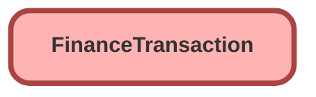

---
hide:
  - path
---

## Schema

<!-- Object description -->

## Fields

| Name      | Label | Type | Description |
| :-------- | :---- | :--: | :---------- | 
| AccountId |  | Lookup | <!-- --> |
| AdjustmentAmount |  |  | <!-- --> |
| BaseCurrencyAmount |  |  | <!-- --> |
| BaseCurrencyBalance |  |  | <!-- --> |
| BaseCurrencyFxDate |  |  | <!-- --> |
| BaseCurrencyFxRate |  |  | <!-- --> |
| BaseCurrencyIsoCode |  |  | <!-- --> |
| ChargeAmount |  |  | <!-- --> |
| CreationMode |  |  | <!-- --> |
| DestinationEntityId |  | Lookup | <!-- --> |
| DueDate |  |  | <!-- --> |
| EffectiveDate |  |  | <!-- --> |
| EventAction |  | Picklist | <!-- --> |
| EventType |  | Picklist | <!-- --> |
| FinanceSystemIntegrationMode |  |  | <!-- --> |
| FinanceSystemIntegrationStatus |  |  | <!-- --> |
| FinanceSystemName |  |  | <!-- --> |
| FinanceSystemTransactionNumber |  |  | <!-- --> |
| ImpactAmount |  |  | <!-- --> |
| LegalEntityId |  | Lookup | <!-- --> |
| OriginalCreditGlAccountName |  |  | <!-- --> |
| OriginalCreditGlAccountNumber |  |  | <!-- --> |
| OriginalDebitGlAccountName |  |  | <!-- --> |
| OriginalDebitGlAccountNumber |  |  | <!-- --> |
| OriginalEventAction |  |  | <!-- --> |
| OriginalEventType |  |  | <!-- --> |
| OriginalFinanceBookName |  |  | <!-- --> |
| OriginalFinancePeriodEndDate |  |  | <!-- --> |
| OriginalFinancePeriodName |  |  | <!-- --> |
| OriginalFinancePeriodStartDate |  |  | <!-- --> |
| OriginalFinancePeriodStatus |  |  | <!-- --> |
| OriginalGlRuleName |  |  | <!-- --> |
| OriginalGlTreatmentName |  |  | <!-- --> |
| OriginalReferenceEntityType |  |  | <!-- --> |
| OwnerId |  | Lookup | <!-- --> |
| ParentReferenceEntityId |  | Lookup | <!-- --> |
| ReferenceEntityId |  | Lookup | <!-- --> |
| ReferenceEntityType |  | Picklist | <!-- --> |
| ResultingBalance |  |  | <!-- --> |
| SourceEntityId |  | Lookup | <!-- --> |
| Subtotal |  |  | <!-- --> |
| TaxAmount |  |  | <!-- --> |
| TotalAmountWithTax |  |  | <!-- --> |
| TransactionDate |  |  | <!-- --> |

_Documentation generated with [sfdx-hardis](https://sfdx-hardis.cloudity.com)_
