---
hide:
  - path
---

## Schema

```mermaid
graph TD
House__c["House"]:::mainObject
click House__c "/objects/House__c/"


classDef object fill:#D6E9FF,stroke:#0070D2,stroke-width:3px,rx:12px,ry:12px,shadow:drop,color:#333;
classDef customObject fill:#FFF4C2,stroke:#CCAA00,stroke-width:3px,rx:12px,ry:12px,shadow:drop,color:#333;
classDef customObjectManaged fill:#FFD8B2,stroke:#CC5500,stroke-width:3px,rx:12px,ry:12px,shadow:drop,color:#333;
classDef mainObject fill:#FFB3B3,stroke:#A94442,stroke-width:4px,rx:14px,ry:14px,shadow:drop,color:#333,font-weight:bold;

```

<!-- Object description -->

## Fields

| Name      | Label | Type | Description |
| :-------- | :---- | :--: | :---------- | 
| Address__c | Address | Text | <!-- --> |
| Bathrooms__c | Bathrooms | Number | <!-- --> |
| Bedroom__c | Bedroom | Number | <!-- --> |
| City__c | City | Text | <!-- --> |
| Picture__c | Picture | Url | <!-- --> |
| Price__c | Price | Number | <!-- --> |
| State__c | State | Text | <!-- --> |
| Zip__c | Zip | Text | <!-- --> |

## Related Apex Classes

| Apex Class | Type |
| :----      | :--: | 
| [HouseService](../apex/HouseService.md) | Lightning Controller |

_Documentation generated with [sfdx-hardis](https://sfdx-hardis.cloudity.com)_
