---
hide:
  - path
---

## Schema

```mermaid
graph TD
Incident["Incident"]:::mainObject
click Incident "/objects/Incident/"


classDef object fill:#D6E9FF,stroke:#0070D2,stroke-width:3px,rx:12px,ry:12px,shadow:drop,color:#333;
classDef customObject fill:#FFF4C2,stroke:#CCAA00,stroke-width:3px,rx:12px,ry:12px,shadow:drop,color:#333;
classDef customObjectManaged fill:#FFD8B2,stroke:#CC5500,stroke-width:3px,rx:12px,ry:12px,shadow:drop,color:#333;
classDef mainObject fill:#FFB3B3,stroke:#A94442,stroke-width:4px,rx:14px,ry:14px,shadow:drop,color:#333,font-weight:bold;

```

<!-- Object description -->

## Fields

| Name      | Label | Type | Description |
| :-------- | :---- | :--: | :---------- | 
| BusinessHoursId |  | Lookup | <!-- --> |
| Category |  | Picklist | <!-- --> |
| Description |  |  | <!-- --> |
| DetectedDateTime |  |  | <!-- --> |
| EndDateTime |  |  | <!-- --> |
| EntitlementId |  | Lookup | <!-- --> |
| Impact |  | Picklist | <!-- --> |
| IsClosed |  |  | <!-- --> |
| IsMajorIncident |  |  | <!-- --> |
| IsStopped |  |  | <!-- --> |
| MilestoneStatus |  |  | <!-- --> |
| OwnerId |  | Lookup | <!-- --> |
| ParentIncidentId |  | Hierarchy | <!-- --> |
| Priority |  | Picklist | <!-- --> |
| PriorityOverrideReason |  |  | <!-- --> |
| ReportedMethod |  | Picklist | <!-- --> |
| ResolutionDateTime |  |  | <!-- --> |
| ResolutionSummary |  |  | <!-- --> |
| ResolvedById |  | Lookup | <!-- --> |
| SlaExitDate |  |  | <!-- --> |
| SlaStartDate |  |  | <!-- --> |
| StartDateTime |  |  | <!-- --> |
| Status |  | Picklist | <!-- --> |
| StatusCode |  |  | <!-- --> |
| StopStartDate |  |  | <!-- --> |
| SubCategory |  | Picklist | <!-- --> |
| Subject |  |  | <!-- --> |
| Type |  | Picklist | <!-- --> |
| Urgency |  | Picklist | <!-- --> |

_Documentation generated with [sfdx-hardis](https://sfdx-hardis.cloudity.com)_
