---
hide:
  - path
---

## Schema

```mermaid
graph TD
InvoiceLine["InvoiceLine"]:::mainObject
click InvoiceLine "/objects/InvoiceLine/"


classDef object fill:#D6E9FF,stroke:#0070D2,stroke-width:3px,rx:12px,ry:12px,shadow:drop,color:#333;
classDef customObject fill:#FFF4C2,stroke:#CCAA00,stroke-width:3px,rx:12px,ry:12px,shadow:drop,color:#333;
classDef customObjectManaged fill:#FFD8B2,stroke:#CC5500,stroke-width:3px,rx:12px,ry:12px,shadow:drop,color:#333;
classDef mainObject fill:#FFB3B3,stroke:#A94442,stroke-width:4px,rx:14px,ry:14px,shadow:drop,color:#333,font-weight:bold;

```

<!-- Object description -->

## Fields

| Name      | Label | Type | Description |
| :-------- | :---- | :--: | :---------- | 
| AdjustmentAmount |  |  | <!-- --> |
| AdjustmentAmountWithTax |  |  | <!-- --> |
| AdjustmentTaxAmount |  |  | <!-- --> |
| ChargeAmount |  |  | <!-- --> |
| ChargeAmountWithTax |  |  | <!-- --> |
| ChargeTaxAmount |  |  | <!-- --> |
| CorpCurrencyCnvChargeAmt |  |  | <!-- --> |
| CorpCurrencyCnvTotalTaxAmt |  |  | <!-- --> |
| CorporateCurrencyCvsnDate |  |  | <!-- --> |
| CorporateCurrencyCvsnRate |  |  | <!-- --> |
| CorporateCurrencyIsoCode |  |  | <!-- --> |
| CurrencyIsoCode |  |  | <!-- --> |
| Description |  |  | <!-- --> |
| InvoiceId |  | MasterDetail | <!-- --> |
| InvoiceLineEndDate |  |  | <!-- --> |
| InvoiceLineStartDate |  |  | <!-- --> |
| InvoiceStatus |  |  | <!-- --> |
| LineAmount |  |  | <!-- --> |
| Name |  |  | <!-- --> |
| Product2Id |  | Lookup | <!-- --> |
| Quantity |  |  | <!-- --> |
| ReferenceEntityItemId |  | Lookup | <!-- --> |
| ReferenceEntityItemTypeCode |  |  | <!-- --> |
| RelatedLineId |  | Lookup | <!-- --> |
| TaxAmount |  |  | <!-- --> |
| TaxCode |  |  | <!-- --> |
| TaxEffectiveDate |  |  | <!-- --> |
| TaxName |  |  | <!-- --> |
| TaxRate |  |  | <!-- --> |
| Type |  |  | <!-- --> |
| UnitPrice |  |  | <!-- --> |

_Documentation generated with [sfdx-hardis](https://sfdx-hardis.cloudity.com)_
