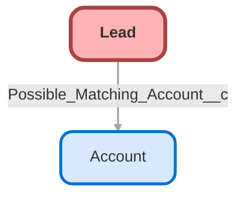

---
hide:
  - path
---

## Schema

<!-- Object description -->

## Fields

| Name      | Label | Type | Description |
| :-------- | :---- | :--: | :---------- | 
| Address |  |  | <!-- --> |
| AnnualRevenue |  |  | <!-- --> |
| CampaignId |  | Lookup | <!-- --> |
| CleanStatus |  |  | <!-- --> |
| Comments__c | Commentaire | Text | <!-- --> |
| Company |  |  | <!-- --> |
| CompanyDunsNumber |  |  | <!-- --> |
| Competitor_1__c | Competitor 1 | Picklist | <!-- --> |
| Competitor_1_Price__c | Competitor 1 Price | Currency | <!-- --> |
| Competitor_2__c | Competitor 2 | Picklist | <!-- --> |
| Competitor_2_Price__c | Competitor 2 Price | Currency | <!-- --> |
| Competitor_3__c | Competitor 3 | Picklist | <!-- --> |
| Competitor_3_Price__c | Competitor 3 Price | Currency | <!-- --> |
| CurrencyIsoCode |  |  | <!-- --> |
| CurrentGenerators__c | Current Generator(s) | Text | <!-- --> |
| DandbCompanyId |  | Lookup | <!-- --> |
| Description |  |  | <!-- --> |
| DoNotCall |  |  | <!-- --> |
| Email |  |  | <!-- --> |
| Fax |  |  | <!-- --> |
| GenderIdentity |  | Picklist | <!-- --> |
| HasOptedOutOfEmail |  |  | <!-- --> |
| HasOptedOutOfFax |  |  | <!-- --> |
| IndividualId |  | Lookup | <!-- --> |
| Industry |  | Picklist | <!-- --> |
| Jigsaw |  |  | <!-- --> |
| LastTransferDate |  |  | <!-- --> |
| Lead_Competitor__c | Lead Competitor | Picklist | <!-- --> |
| Lead_Name_Competitor__c | Lead Name Competitor | Currency | <!-- --> |
| LeadSource |  | Picklist | <!-- --> |
| MobilePhone |  |  | <!-- --> |
| Name |  |  | <!-- --> |
| NumberOfEmployees |  |  | <!-- --> |
| NumberofLocations__c | Number of Locations | Number | <!-- --> |
| OwnerId |  | Lookup | <!-- --> |
| Phone |  |  | <!-- --> |
| Possible_Matching_Account__c | Possible Matching Account | Lookup | <!-- --> |
| Primary__c | Primary | Picklist | <!-- --> |
| ProductInterest__c | Product Interest | Picklist | <!-- --> |
| Pronouns |  | Picklist | <!-- --> |
| Rating |  | Picklist | <!-- --> |
| SICCode__c | SIC Code | Text | <!-- --> |
| Status |  | Picklist | <!-- --> |
| Title |  |  | <!-- --> |
| Website |  |  | <!-- --> |

## Related Flows

| Object | Name      | Type | Description |
| :----  | :-------- | :--: | :---------- | 
| Lead | [Check_New_Lead_for_Matching_Account](../flows/Check_New_Lead_for_Matching_Account.md) [🕒](../flows/Check_New_Lead_for_Matching_Account-history.md) |  Record After Save | <!-- --> |

## Related Apex Classes

| Apex Class | Type |
| :----      | :--: | 
| [ContactAndLeadSearch](../apex/ContactAndLeadSearch.md) | Class |
| [HelloWorldTest](../apex/HelloWorldTest.md) | Test |
| [LeadCompetitorTest](../apex/LeadCompetitorTest.md) | Test |

## Related Lightning Pages

| Lightning Page | Type |
| :----      | :--: | 
| [Contact_Record_Page](../pages/Contact_Record_Page.md) |  Record Page |

_Documentation generated with [sfdx-hardis](https://sfdx-hardis.cloudity.com)_
