---
hide:
  - path
---

## Schema

```mermaid
graph TD
Location["Location"]:::mainObject
click Location "/objects/Location/"


classDef object fill:#D6E9FF,stroke:#0070D2,stroke-width:3px,rx:12px,ry:12px,shadow:drop,color:#333;
classDef customObject fill:#FFF4C2,stroke:#CCAA00,stroke-width:3px,rx:12px,ry:12px,shadow:drop,color:#333;
classDef customObjectManaged fill:#FFD8B2,stroke:#CC5500,stroke-width:3px,rx:12px,ry:12px,shadow:drop,color:#333;
classDef mainObject fill:#FFB3B3,stroke:#A94442,stroke-width:4px,rx:14px,ry:14px,shadow:drop,color:#333,font-weight:bold;

```

<!-- Object description -->

## Fields

| Name      | Label | Type | Description |
| :-------- | :---- | :--: | :---------- | 
| CloseDate |  |  | <!-- --> |
| ConstructionEndDate |  |  | <!-- --> |
| ConstructionStartDate |  |  | <!-- --> |
| Description |  |  | <!-- --> |
| DrivingDirections |  |  | <!-- --> |
| ExternalReference |  |  | <!-- --> |
| IsInventoryLocation |  |  | <!-- --> |
| IsMobile |  |  | <!-- --> |
| Location |  |  | <!-- --> |
| LocationLevel |  |  | <!-- --> |
| LocationType |  | Picklist | <!-- --> |
| LogoId |  | Lookup | <!-- --> |
| Name |  |  | <!-- --> |
| OpenDate |  |  | <!-- --> |
| OwnerId |  | Lookup | <!-- --> |
| ParentLocationId |  | Hierarchy | <!-- --> |
| PossessionDate |  |  | <!-- --> |
| RemodelEndDate |  |  | <!-- --> |
| RemodelStartDate |  |  | <!-- --> |
| RootLocationId |  | Lookup | <!-- --> |
| ShouldSyncWithOci |  |  | <!-- --> |
| TimeZone |  |  | <!-- --> |

## Related Apex Classes

| Apex Class | Type |
| :----      | :--: | 
| [PropertyController](../apex/PropertyController.md) | Lightning Controller |

## Related Lightning Pages

| Lightning Page | Type |
| :----      | :--: | 
| [Property_Record_Page](../pages/Property_Record_Page.md) |  Record Page |

_Documentation generated with [sfdx-hardis](https://sfdx-hardis.cloudity.com)_
