---
hide:
  - path
---

## Schema

```mermaid
graph TD
Opportunity["Opportunity"]:::mainObject
click Opportunity "/objects/Opportunity/"


classDef object fill:#D6E9FF,stroke:#0070D2,stroke-width:3px,rx:12px,ry:12px,shadow:drop,color:#333;
classDef customObject fill:#FFF4C2,stroke:#CCAA00,stroke-width:3px,rx:12px,ry:12px,shadow:drop,color:#333;
classDef customObjectManaged fill:#FFD8B2,stroke:#CC5500,stroke-width:3px,rx:12px,ry:12px,shadow:drop,color:#333;
classDef mainObject fill:#FFB3B3,stroke:#A94442,stroke-width:4px,rx:14px,ry:14px,shadow:drop,color:#333,font-weight:bold;

```

<!-- Object description -->

## Fields

| Name      | Label | Type | Description |
| :-------- | :---- | :--: | :---------- | 
| AccountId |  | Lookup | <!-- --> |
| Amount |  |  | <!-- --> |
| Approval_Status__c | Approval Status | Picklist | <!-- --> |
| CampaignId |  | Lookup | <!-- --> |
| CloseDate |  |  | <!-- --> |
| comments__c | comments | Text | <!-- --> |
| ContractId |  | Lookup | <!-- --> |
| CurrencyIsoCode |  |  | <!-- --> |
| CurrentGenerators__c | Current Generator(s) | Text | <!-- --> |
| DeliveryInstallationStatus__c | Delivery/Installation Status | Picklist | <!-- --> |
| Description |  |  | <!-- --> |
| Discount_Percentage__c | Discount Percentage | Percent | <!-- --> |
| ExpectedRevenue |  |  | <!-- --> |
| IqScore |  |  | <!-- --> |
| IsExcludedFromTerritory2Filter |  |  | <!-- --> |
| IsPrivate |  |  | <!-- --> |
| LeadSource |  | Picklist | <!-- --> |
| MainCompetitors__c | Main Competitor(s) | Text | <!-- --> |
| Name |  |  | <!-- --> |
| NextStep |  |  | <!-- --> |
| OrderNumber__c | Order Number | Text | <!-- --> |
| OwnerId |  | Lookup | <!-- --> |
| Pricebook2Id |  | Lookup | <!-- --> |
| Probability |  |  | <!-- --> |
| StageName |  | Picklist | <!-- --> |
| SyncedQuoteId |  | Lookup | <!-- --> |
| Territory2Id |  | Lookup | <!-- --> |
| TotalOpportunityQuantity |  |  | <!-- --> |
| TrackingNumber__c | Tracking Number | Text | <!-- --> |
| Type |  | Picklist | <!-- --> |

## Related Flows

| Object | Name      | Type | Description |
| :----  | :-------- | :--: | :---------- | 
| 💻 | [Fetch_Related_Records](../flows/Fetch_Related_Records.md) [🕒](../flows/Fetch_Related_Records-history.md) |  Screen Flow | <!-- --> |
| 💻 | [Subflow_Create_Generator_Opp_Product](../flows/Subflow_Create_Generator_Opp_Product.md) [🕒](../flows/Subflow_Create_Generator_Opp_Product-history.md) |  Auto Launched Flow | <!-- --> |
| Opportunity | [Add_Generator_Product_to_Named_Opps](../flows/Add_Generator_Product_to_Named_Opps.md) [🕒](../flows/Add_Generator_Product_to_Named_Opps-history.md) |  Record After Save | <!-- --> |
| Opportunity | [Add_VIP_to_Description](../flows/Add_VIP_to_Description.md) [🕒](../flows/Add_VIP_to_Description-history.md) |  Record After Save | <!-- --> |
| Opportunity | [Create_Follow_Up_with_Decision_Maker](../flows/Create_Follow_Up_with_Decision_Maker.md) [🕒](../flows/Create_Follow_Up_with_Decision_Maker-history.md) |  Record After Save | <!-- --> |
| Opportunity | [Review_Opportunity_with_Account_Owner](../flows/Review_Opportunity_with_Account_Owner.md) [🕒](../flows/Review_Opportunity_with_Account_Owner-history.md) |  Record After Save | When a high-value opportunity is ready for negotiation and review, create a task for the owner to follow up with the account owner |
| Opportunity | [test](../flows/test.md) [🕒](../flows/test-history.md) |  Record After Save | <!-- --> |

## Related Apex Classes

| Apex Class | Type |
| :----      | :--: | 
| [AppleWatchTest](../apex/AppleWatchTest.md) | Test |
| [DataGenerationTest](../apex/DataGenerationTest.md) | Test |
| [TestFactory](../apex/TestFactory.md) | Test |

_Documentation generated with [sfdx-hardis](https://sfdx-hardis.cloudity.com)_
