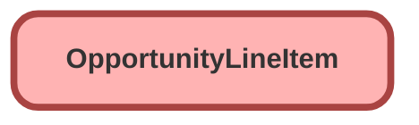

---
hide:
  - path
---

## Schema

<!-- Object description -->

## Fields

| Name      | Label | Type | Description |
| :-------- | :---- | :--: | :---------- | 
| Description |  |  | <!-- --> |
| Discount |  |  | <!-- --> |
| ListPrice |  |  | <!-- --> |
| Name |  |  | <!-- --> |
| OpportunityId |  | Lookup | <!-- --> |
| Product2Id |  | Lookup | <!-- --> |
| ProductCode |  |  | <!-- --> |
| Quantity |  |  | <!-- --> |
| ServiceDate |  |  | <!-- --> |
| Subtotal |  |  | <!-- --> |
| TotalPrice |  |  | <!-- --> |
| UnitPrice |  |  | <!-- --> |

## Related Flows

| Object | Name      | Type | Description |
| :----  | :-------- | :--: | :---------- | 
| 💻 | [Subflow_Create_Generator_Opp_Product](../flows/Subflow_Create_Generator_Opp_Product.md) [🕒](../flows/Subflow_Create_Generator_Opp_Product-history.md) |  Auto Launched Flow | <!-- --> |
| Opportunity | [test](../flows/test.md) [🕒](../flows/test-history.md) |  Record After Save | <!-- --> |

_Documentation generated with [sfdx-hardis](https://sfdx-hardis.cloudity.com)_
