---
hide:
  - path
---

## Schema

```mermaid
graph TD
Order["Order"]:::mainObject
click Order "/objects/Order/"


classDef object fill:#D6E9FF,stroke:#0070D2,stroke-width:3px,rx:12px,ry:12px,shadow:drop,color:#333;
classDef customObject fill:#FFF4C2,stroke:#CCAA00,stroke-width:3px,rx:12px,ry:12px,shadow:drop,color:#333;
classDef customObjectManaged fill:#FFD8B2,stroke:#CC5500,stroke-width:3px,rx:12px,ry:12px,shadow:drop,color:#333;
classDef mainObject fill:#FFB3B3,stroke:#A94442,stroke-width:4px,rx:14px,ry:14px,shadow:drop,color:#333,font-weight:bold;

```

<!-- Object description -->

## Fields

| Name      | Label | Type | Description |
| :-------- | :---- | :--: | :---------- | 
| AccountId |  | Lookup | <!-- --> |
| AccountNumber |  |  | <!-- --> |
| ActivatedById |  | Lookup | <!-- --> |
| ActivatedDate |  |  | <!-- --> |
| BillingAddress |  |  | <!-- --> |
| BillToContactId |  | Lookup | <!-- --> |
| CompanyAuthorizedById |  | Lookup | <!-- --> |
| CompanyAuthorizedDate |  |  | <!-- --> |
| ContractEndDate |  |  | <!-- --> |
| ContractId |  | Lookup | <!-- --> |
| ContractName |  |  | <!-- --> |
| CurrencyIsoCode |  |  | <!-- --> |
| CustomerAuthorizedById |  | Lookup | <!-- --> |
| CustomerAuthorizedDate |  |  | <!-- --> |
| Description |  |  | <!-- --> |
| EffectiveDate |  |  | <!-- --> |
| EndDate |  |  | <!-- --> |
| IsReductionOrder |  |  | <!-- --> |
| Name |  |  | <!-- --> |
| OpportunityId |  | Lookup | <!-- --> |
| OrderReferenceNumber |  |  | <!-- --> |
| OriginalOrderId |  | Lookup | <!-- --> |
| OwnerId |  | Lookup | <!-- --> |
| PoDate |  |  | <!-- --> |
| PoNumber |  |  | <!-- --> |
| Pricebook2Id |  | Lookup | <!-- --> |
| QuoteId |  | Lookup | <!-- --> |
| ShippingAddress |  |  | <!-- --> |
| ShipToContactId |  | Lookup | <!-- --> |
| Status |  | Picklist | <!-- --> |
| TotalAmount |  |  | <!-- --> |
| Type |  | Picklist | <!-- --> |

## Related Apex Classes

| Apex Class | Type |
| :----      | :--: | 
| [bot_DataController](../apex/bot_DataController.md) | Invocable |

## Related Lightning Pages

| Lightning Page | Type |
| :----      | :--: | 
| [botanicals_home_page](../pages/botanicals_home_page.md) |  Home Page |

_Documentation generated with [sfdx-hardis](https://sfdx-hardis.cloudity.com)_
