---
hide:
  - path
---

## Schema

```mermaid
graph TD
OrderItem["OrderItem"]:::mainObject
click OrderItem "/objects/OrderItem/"


classDef object fill:#D6E9FF,stroke:#0070D2,stroke-width:3px,rx:12px,ry:12px,shadow:drop,color:#333;
classDef customObject fill:#FFF4C2,stroke:#CCAA00,stroke-width:3px,rx:12px,ry:12px,shadow:drop,color:#333;
classDef customObjectManaged fill:#FFD8B2,stroke:#CC5500,stroke-width:3px,rx:12px,ry:12px,shadow:drop,color:#333;
classDef mainObject fill:#FFB3B3,stroke:#A94442,stroke-width:4px,rx:14px,ry:14px,shadow:drop,color:#333,font-weight:bold;

```

<!-- Object description -->

## Fields

| Name      | Label | Type | Description |
| :-------- | :---- | :--: | :---------- | 
| AvailableQuantity |  |  | <!-- --> |
| colorTheme__c | Color Theme | Picklist | <!-- --> |
| Description |  |  | <!-- --> |
| EndDate |  |  | <!-- --> |
| fragrance__c | Fragrance | Picklist | If the bouquet has a fragrance, what does it smell like? |
| glow__c | Glow | Picklist | <!-- --> |
| ListPrice |  |  | <!-- --> |
| numberOfFlowers__c | Number of Flowers | Number | The number of flowers in the bouquet |
| OrderId |  | Lookup | <!-- --> |
| OriginalOrderItemId |  | Lookup | <!-- --> |
| percentOfOpening__c | Percent of Flower Opening | Percent | How open are the flowers in the bouquet? |
| Product2Id |  | Lookup | <!-- --> |
| ProductCode |  |  | <!-- --> |
| Quantity |  |  | <!-- --> |
| QuoteLineItemId |  | Lookup | <!-- --> |
| ServiceDate |  |  | <!-- --> |
| SubscriptionTerm |  |  | <!-- --> |
| TotalPrice |  |  | <!-- --> |
| UnitPrice |  |  | <!-- --> |

_Documentation generated with [sfdx-hardis](https://sfdx-hardis.cloudity.com)_
