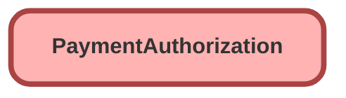

---
hide:
  - path
---

## Schema

<!-- Object description -->

## Fields

| Name      | Label | Type | Description |
| :-------- | :---- | :--: | :---------- | 
| AccountId |  | Lookup | <!-- --> |
| Amount |  |  | <!-- --> |
| Balance |  |  | <!-- --> |
| Comments |  |  | <!-- --> |
| Date |  |  | <!-- --> |
| EffectiveDate |  |  | <!-- --> |
| Email |  |  | <!-- --> |
| ExpirationDate |  |  | <!-- --> |
| GatewayAuthCode |  |  | <!-- --> |
| GatewayDate |  |  | <!-- --> |
| GatewayRefDetails |  |  | <!-- --> |
| GatewayRefNumber |  |  | <!-- --> |
| GatewayResultCode |  |  | <!-- --> |
| GatewayResultCodeDescription |  |  | <!-- --> |
| IpAddress |  |  | <!-- --> |
| MacAddress |  |  | <!-- --> |
| PaymentGatewayId |  | Lookup | <!-- --> |
| PaymentGroupId |  | Lookup | <!-- --> |
| PaymentMethodId |  | Lookup | <!-- --> |
| Phone |  |  | <!-- --> |
| ProcessingMode |  |  | <!-- --> |
| SfResultCode |  |  | <!-- --> |
| Status |  |  | <!-- --> |
| TotalAuthReversalAmount |  |  | <!-- --> |
| TotalPaymentCaptureAmount |  |  | <!-- --> |

_Documentation generated with [sfdx-hardis](https://sfdx-hardis.cloudity.com)_
