---
hide:
  - path
---

## Schema

```mermaid
graph TD
Pricebook2["Pricebook2"]:::mainObject
click Pricebook2 "/objects/Pricebook2/"


classDef object fill:#D6E9FF,stroke:#0070D2,stroke-width:3px,rx:12px,ry:12px,shadow:drop,color:#333;
classDef customObject fill:#FFF4C2,stroke:#CCAA00,stroke-width:3px,rx:12px,ry:12px,shadow:drop,color:#333;
classDef customObjectManaged fill:#FFD8B2,stroke:#CC5500,stroke-width:3px,rx:12px,ry:12px,shadow:drop,color:#333;
classDef mainObject fill:#FFB3B3,stroke:#A94442,stroke-width:4px,rx:14px,ry:14px,shadow:drop,color:#333,font-weight:bold;

```

<!-- Object description -->

## Fields

| Name      | Label | Type | Description |
| :-------- | :---- | :--: | :---------- | 
| Description |  |  | <!-- --> |
| IsActive |  |  | <!-- --> |
| IsStandard |  |  | <!-- --> |
| Name |  |  | <!-- --> |
| Region__c | Region | Picklist | Price book region |

## Related Flows

| Object | Name      | Type | Description |
| :----  | :-------- | :--: | :---------- | 
| Opportunity | [Add_Generator_Product_to_Named_Opps](../flows/Add_Generator_Product_to_Named_Opps.md) [🕒](../flows/Add_Generator_Product_to_Named_Opps-history.md) |  Record After Save | <!-- --> |
| Opportunity | [test](../flows/test.md) [🕒](../flows/test-history.md) |  Record After Save | <!-- --> |

## Related Apex Classes

| Apex Class | Type |
| :----      | :--: | 
| [bot_DataController](../apex/bot_DataController.md) | Invocable |

_Documentation generated with [sfdx-hardis](https://sfdx-hardis.cloudity.com)_
