---
hide:
  - path
---

## Schema

```mermaid
graph TD
Product2["Product2"]:::mainObject
click Product2 "/objects/Product2/"


classDef object fill:#D6E9FF,stroke:#0070D2,stroke-width:3px,rx:12px,ry:12px,shadow:drop,color:#333;
classDef customObject fill:#FFF4C2,stroke:#CCAA00,stroke-width:3px,rx:12px,ry:12px,shadow:drop,color:#333;
classDef customObjectManaged fill:#FFD8B2,stroke:#CC5500,stroke-width:3px,rx:12px,ry:12px,shadow:drop,color:#333;
classDef mainObject fill:#FFB3B3,stroke:#A94442,stroke-width:4px,rx:14px,ry:14px,shadow:drop,color:#333,font-weight:bold;

```

<!-- Object description -->

## Fields

| Name      | Label | Type | Description |
| :-------- | :---- | :--: | :---------- | 
| colorTheme__c | Color Theme | Picklist | <!-- --> |
| CurrencyIsoCode |  |  | <!-- --> |
| Description |  |  | <!-- --> |
| DisplayUrl |  |  | <!-- --> |
| ExternalDataSourceId |  | Lookup | <!-- --> |
| ExternalId |  |  | <!-- --> |
| Family |  | Picklist | <!-- --> |
| fragrance__c | Fragrance | Picklist | <!-- --> |
| glow__c | Glow | Picklist | <!-- --> |
| Ground_mount__c | Ground-mount | Checkbox | Identifies non-roof panels |
| IsActive |  |  | <!-- --> |
| Name |  |  | <!-- --> |
| numberOfFlowers__c | Number of Flowers | Number | <!-- --> |
| percentOfOpening__c | Percent of Flower Opening | Percent | How open are the flowers in the bouquet? |
| ProductCode |  |  | <!-- --> |
| QuantityUnitOfMeasure |  | Picklist | <!-- --> |
| SellerId |  | Lookup | <!-- --> |
| SourceProductId |  | Lookup | <!-- --> |
| StockKeepingUnit |  |  | <!-- --> |

## Related Flows

| Object | Name      | Type | Description |
| :----  | :-------- | :--: | :---------- | 
| 💻 | [Subflow_Create_Generator_Opp_Product](../flows/Subflow_Create_Generator_Opp_Product.md) [🕒](../flows/Subflow_Create_Generator_Opp_Product-history.md) |  Auto Launched Flow | <!-- --> |
| Opportunity | [test](../flows/test.md) [🕒](../flows/test-history.md) |  Record After Save | <!-- --> |

## Related Apex Classes

| Apex Class | Type |
| :----      | :--: | 
| [bot_DataController](../apex/bot_DataController.md) | Invocable |

## Related Lightning Pages

| Lightning Page | Type |
| :----      | :--: | 
| [botanicals_home_page](../pages/botanicals_home_page.md) |  Home Page |

_Documentation generated with [sfdx-hardis](https://sfdx-hardis.cloudity.com)_
