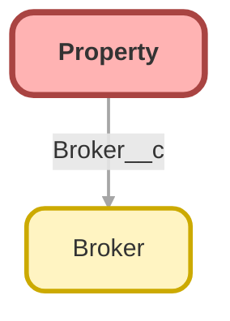

---
hide:
  - path
---

## Schema

<!-- Object description -->

## Fields

| Name      | Label | Type | Description |
| :-------- | :---- | :--: | :---------- | 
| Address__c | Address | Text | <!-- --> |
| Assessed_Value__c | Assessed Value | Currency | <!-- --> |
| Baths__c | Baths | Number | <!-- --> |
| Beds__c | Beds | Number | <!-- --> |
| Broker__c | Broker | Lookup | <!-- --> |
| City__c | City | Text | <!-- --> |
| Date_Agreement__c | Date Agreement | Date | <!-- --> |
| Date_Closed__c | Date Closed | Date | <!-- --> |
| Date_Contracted__c | Date Contracted | Date | <!-- --> |
| Date_Listed__c | Date Listed | Date | <!-- --> |
| Date_Pre_Market__c | Date Pre Market | Date | <!-- --> |
| Days_On_Market__c | Days On Market | Number | <!-- --> |
| Description__c | Description | LongTextArea | <!-- --> |
| Location__c | Location | Location | <!-- --> |
| Picture__c | Picture | Url | <!-- --> |
| Picture_IMG__c | Main Picture | Text | <!-- --> |
| Price__c | Asking Price | Currency | <!-- --> |
| Price_Sold__c | Price Sold | Currency | <!-- --> |
| Record_Link__c | Record Link | Text | <!-- --> |
| State__c | State | Text | <!-- --> |
| Status__c | Status | Picklist | <!-- --> |
| Tags__c | Tags | Text | <!-- --> |
| Thumbnail__c | Thumbnail | Url | <!-- --> |
| Thumbnail_IMG__c | Main Thumbnail | Text | <!-- --> |
| Zip__c | Zip | Text | <!-- --> |

## Related Flows

| Object | Name      | Type | Description |
| :----  | :-------- | :--: | :---------- | 
| 💻 | [Create_property](../flows/Create_property.md) [🕒](../flows/Create_property-history.md) |  Screen Flow | This flow helps agents creating new properties in just a few clicks. It calculates the geocoded address calling out to a 3rd party service. |

## Related Apex Classes

| Apex Class | Type |
| :----      | :--: | 
| [FileUtilitiesTest](../apex/FileUtilitiesTest.md) | Test |
| [PropertyController](../apex/PropertyController.md) | Lightning Controller |
| [SampleDataController](../apex/SampleDataController.md) | Lightning Controller |
| [TestPropertyController](../apex/TestPropertyController.md) | Test |
| [TestSampleDataController](../apex/TestSampleDataController.md) | Test |

## Related Lightning Pages

| Lightning Page | Type |
| :----      | :--: | 
| [Property_Record_Page](../pages/Property_Record_Page.md) |  Record Page |

_Documentation generated with [sfdx-hardis](https://sfdx-hardis.cloudity.com)_
