---
hide:
  - path
---

## Schema

```mermaid
graph TD
Rider_History__b["Rider History"]:::mainObject
click Rider_History__b "/objects/Rider_History__b/"


classDef object fill:#D6E9FF,stroke:#0070D2,stroke-width:3px,rx:12px,ry:12px,shadow:drop,color:#333;
classDef customObject fill:#FFF4C2,stroke:#CCAA00,stroke-width:3px,rx:12px,ry:12px,shadow:drop,color:#333;
classDef customObjectManaged fill:#FFD8B2,stroke:#CC5500,stroke-width:3px,rx:12px,ry:12px,shadow:drop,color:#333;
classDef mainObject fill:#FFB3B3,stroke:#A94442,stroke-width:4px,rx:14px,ry:14px,shadow:drop,color:#333,font-weight:bold;

```

<!-- Object description -->

## Fields

| Name      | Label | Type | Description |
| :-------- | :---- | :--: | :---------- | 
| End_Time__c | End Time | DateTime | <!-- --> |
| Rider_Account__c | Rider Account | Text | <!-- --> |
| Rider_Rating__c | Rider Rating | Number | <!-- --> |
| Service_Type__c | Service Type | Text | <!-- --> |
| Start_Location_Latitude__c | Start Location Latitude | Number | <!-- --> |
| Start_Location_Longitude__c | Start Location Longitude | Number | <!-- --> |
| Start_Time__c | Start Time | DateTime | <!-- --> |

_Documentation generated with [sfdx-hardis](https://sfdx-hardis.cloudity.com)_
