---
hide:
  - path
---

## Schema

```mermaid
graph TD
ScratchOrgInfo["ScratchOrgInfo"]:::mainObject
click ScratchOrgInfo "/objects/ScratchOrgInfo/"


classDef object fill:#D6E9FF,stroke:#0070D2,stroke-width:3px,rx:12px,ry:12px,shadow:drop,color:#333;
classDef customObject fill:#FFF4C2,stroke:#CCAA00,stroke-width:3px,rx:12px,ry:12px,shadow:drop,color:#333;
classDef customObjectManaged fill:#FFD8B2,stroke:#CC5500,stroke-width:3px,rx:12px,ry:12px,shadow:drop,color:#333;
classDef mainObject fill:#FFB3B3,stroke:#A94442,stroke-width:4px,rx:14px,ry:14px,shadow:drop,color:#333,font-weight:bold;

```

<!-- Object description -->

## Fields

| Name      | Label | Type | Description |
| :-------- | :---- | :--: | :---------- | 
| AdminEmail |  |  | <!-- --> |
| AuthCode |  |  | <!-- --> |
| ConnectedAppCallbackUrl |  |  | <!-- --> |
| ConnectedAppConsumerKey |  |  | <!-- --> |
| Country |  |  | <!-- --> |
| DeletedBy |  |  | <!-- --> |
| DeletedDate |  |  | <!-- --> |
| Description |  |  | <!-- --> |
| Edition |  |  | <!-- --> |
| ErrorCode |  |  | <!-- --> |
| ExpirationDate |  |  | <!-- --> |
| Features |  |  | <!-- --> |
| Instance |  |  | <!-- --> |
| Language |  |  | <!-- --> |
| LastLoginDate |  |  | <!-- --> |
| Name |  |  | <!-- --> |
| Namespace |  |  | <!-- --> |
| OrgName |  |  | <!-- --> |
| Package2AncestorIds |  |  | <!-- --> |
| Release |  |  | <!-- --> |
| ScratchOrg |  |  | <!-- --> |
| SignupCountry |  |  | <!-- --> |
| SignupEmail |  |  | <!-- --> |
| SignupInstance |  |  | <!-- --> |
| SignupLanguage |  |  | <!-- --> |
| SignupTrialDays |  |  | <!-- --> |
| SignupUsername |  |  | <!-- --> |
| SourceOrg |  |  | <!-- --> |
| Status |  |  | <!-- --> |
| Username |  |  | <!-- --> |

_Documentation generated with [sfdx-hardis](https://sfdx-hardis.cloudity.com)_
