---
hide:
  - path
---

## Schema

```mermaid
graph TD
Task["Task"]:::mainObject
click Task "/objects/Task/"


classDef object fill:#D6E9FF,stroke:#0070D2,stroke-width:3px,rx:12px,ry:12px,shadow:drop,color:#333;
classDef customObject fill:#FFF4C2,stroke:#CCAA00,stroke-width:3px,rx:12px,ry:12px,shadow:drop,color:#333;
classDef customObjectManaged fill:#FFD8B2,stroke:#CC5500,stroke-width:3px,rx:12px,ry:12px,shadow:drop,color:#333;
classDef mainObject fill:#FFB3B3,stroke:#A94442,stroke-width:4px,rx:14px,ry:14px,shadow:drop,color:#333,font-weight:bold;

```

<!-- Object description -->

## Fields

| Name      | Label | Type | Description |
| :-------- | :---- | :--: | :---------- | 
| ActivityDate |  |  | <!-- --> |
| CallDisposition |  |  | <!-- --> |
| CallDurationInSeconds |  |  | <!-- --> |
| CallObject |  |  | <!-- --> |
| CallType |  |  | <!-- --> |
| CompletedDateTime |  |  | <!-- --> |
| CurrencyIsoCode |  |  | <!-- --> |
| Description |  |  | <!-- --> |
| Email |  |  | <!-- --> |
| IsRecurrence |  |  | <!-- --> |
| IsReminderSet |  |  | <!-- --> |
| OwnerId |  | Lookup | <!-- --> |
| Phone |  |  | <!-- --> |
| Priority |  | Picklist | <!-- --> |
| RecurrenceInterval |  |  | <!-- --> |
| RecurrenceRegeneratedType |  |  | <!-- --> |
| Status |  | Picklist | <!-- --> |
| Subject |  | Picklist | <!-- --> |
| TaskSubtype |  |  | <!-- --> |
| Type |  | Picklist | <!-- --> |
| WhatId |  | Lookup | <!-- --> |
| WhoId |  | Lookup | <!-- --> |

## Related Flows

| Object | Name      | Type | Description |
| :----  | :-------- | :--: | :---------- | 
| 💻 | [Convert_to_Customer](../flows/Convert_to_Customer.md) [🕒](../flows/Convert_to_Customer-history.md) |  Auto Launched Flow | <!-- --> |
| Account | [Create_Follow_Up_on_New_Prospect](../flows/Create_Follow_Up_on_New_Prospect.md) [🕒](../flows/Create_Follow_Up_on_New_Prospect-history.md) |  Record After Save | <!-- --> |
| Opportunity | [Create_Follow_Up_with_Decision_Maker](../flows/Create_Follow_Up_with_Decision_Maker.md) [🕒](../flows/Create_Follow_Up_with_Decision_Maker-history.md) |  Record After Save | <!-- --> |
| Opportunity | [Review_Opportunity_with_Account_Owner](../flows/Review_Opportunity_with_Account_Owner.md) [🕒](../flows/Review_Opportunity_with_Account_Owner-history.md) |  Record After Save | When a high-value opportunity is ready for negotiation and review, create a task for the owner to follow up with the account owner |

## Related Lightning Pages

| Lightning Page | Type |
| :----      | :--: | 
| [Home_Page_Default](../pages/Home_Page_Default.md) |  Home Page |

_Documentation generated with [sfdx-hardis](https://sfdx-hardis.cloudity.com)_
