---
hide:
  - path
---

## Schema

```mermaid
graph TD
User["User"]:::mainObject
click User "/objects/User/"


classDef object fill:#D6E9FF,stroke:#0070D2,stroke-width:3px,rx:12px,ry:12px,shadow:drop,color:#333;
classDef customObject fill:#FFF4C2,stroke:#CCAA00,stroke-width:3px,rx:12px,ry:12px,shadow:drop,color:#333;
classDef customObjectManaged fill:#FFD8B2,stroke:#CC5500,stroke-width:3px,rx:12px,ry:12px,shadow:drop,color:#333;
classDef mainObject fill:#FFB3B3,stroke:#A94442,stroke-width:4px,rx:14px,ry:14px,shadow:drop,color:#333,font-weight:bold;

```

<!-- Object description -->

## Fields

| Name      | Label | Type | Description |
| :-------- | :---- | :--: | :---------- | 
| AboutMe |  |  | <!-- --> |
| Address |  |  | <!-- --> |
| Alias |  |  | <!-- --> |
| CallCenterId |  | Lookup | <!-- --> |
| CommunityNickname |  |  | <!-- --> |
| CompanyName |  |  | <!-- --> |
| ContactId |  | Lookup | <!-- --> |
| DefaultGroupNotificationFrequency |  |  | <!-- --> |
| DelegatedApproverId |  | Lookup | <!-- --> |
| Department |  |  | <!-- --> |
| DigestFrequency |  |  | <!-- --> |
| Division |  |  | <!-- --> |
| Email |  |  | <!-- --> |
| EmailEncodingKey |  |  | <!-- --> |
| EmployeeNumber |  |  | <!-- --> |
| EndDay |  |  | <!-- --> |
| Extension |  |  | <!-- --> |
| Fax |  |  | <!-- --> |
| FederationIdentifier |  |  | <!-- --> |
| ForecastEnabled |  |  | <!-- --> |
| IndividualId |  | Lookup | <!-- --> |
| IsActive |  |  | <!-- --> |
| IsSystemControlled |  |  | <!-- --> |
| JigsawImportLimitOverride |  |  | <!-- --> |
| LanguageLocaleKey |  |  | <!-- --> |
| LocaleSidKey |  |  | <!-- --> |
| ManagerId |  | Hierarchy | <!-- --> |
| MobilePhone |  |  | <!-- --> |
| Name |  |  | <!-- --> |
| Phone |  |  | <!-- --> |
| ProfileId |  | Lookup | <!-- --> |
| ReceivesAdminInfoEmails |  |  | <!-- --> |
| ReceivesInfoEmails |  |  | <!-- --> |
| SenderEmail |  |  | <!-- --> |
| SenderName |  |  | <!-- --> |
| Signature |  |  | <!-- --> |
| StartDay |  |  | <!-- --> |
| StayInTouchNote |  |  | <!-- --> |
| StayInTouchSignature |  |  | <!-- --> |
| StayInTouchSubject |  |  | <!-- --> |
| TimeZoneSidKey |  |  | <!-- --> |
| Title |  |  | <!-- --> |
| Username |  |  | <!-- --> |
| UserRoleId |  | Lookup | <!-- --> |
| UserSubtype |  |  | <!-- --> |
| WorkspaceId |  | Lookup | <!-- --> |

## Validation Rules

| Rule      | Active | Description | Formula |
| :-------- | :---- | :---------- | :------ |
| NoUsernameChangesAllowed | Yes | Changing usernames in this org may impact your ability to sign in automatically from Trailhead. | `Username != PRIORVALUE(Username)` |

## Related Flows

| Object | Name      | Type | Description |
| :----  | :-------- | :--: | :---------- | 
| Account | [Post_to_Chatter_on_Account_Change_en_send_email](../flows/Post_to_Chatter_on_Account_Change_en_send_email.md) [🕒](../flows/Post_to_Chatter_on_Account_Change_en_send_email-history.md) |  Record After Save | <!-- --> |

## Related Apex Classes

| Apex Class | Type |
| :----      | :--: | 
| [TestFactory](../apex/TestFactory.md) | Test |
| [TestPropertyController](../apex/TestPropertyController.md) | Test |

_Documentation generated with [sfdx-hardis](https://sfdx-hardis.cloudity.com)_
