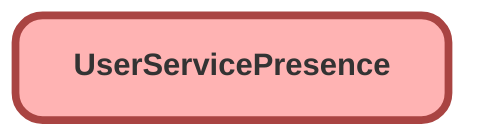

---
hide:
  - path
---

## Schema

<!-- Object description -->

## Fields

| Name      | Label | Type | Description |
| :-------- | :---- | :--: | :---------- | 
| AtCapacityDuration |  |  | <!-- --> |
| AtCapacityStartTime |  |  | <!-- --> |
| AverageCapacity |  |  | <!-- --> |
| AverageCapacityStartTime |  |  | <!-- --> |
| Capacity |  |  | <!-- --> |
| ClusterId |  |  | <!-- --> |
| ConfiguredCapacity |  |  | <!-- --> |
| ConfiguredInterruptCapacity |  |  | <!-- --> |
| IdleDuration |  |  | <!-- --> |
| IdleStartTime |  |  | <!-- --> |
| InterruptibleCapacity |  |  | <!-- --> |
| IsAway |  |  | <!-- --> |
| IsCurrentState |  |  | <!-- --> |
| LASessionId |  |  | <!-- --> |
| OwnerId |  | Lookup | <!-- --> |
| PresenceUserConfig |  |  | <!-- --> |
| PreviousCapacity |  |  | <!-- --> |
| PreviousInterruptibleCapacity |  |  | <!-- --> |
| ServicePresenceStatusId |  | Lookup | <!-- --> |
| StatusEndDate |  |  | <!-- --> |
| StatusSequence |  |  | <!-- --> |
| StatusStartDate |  |  | <!-- --> |
| UserId |  | Lookup | <!-- --> |

_Documentation generated with [sfdx-hardis](https://sfdx-hardis.cloudity.com)_
